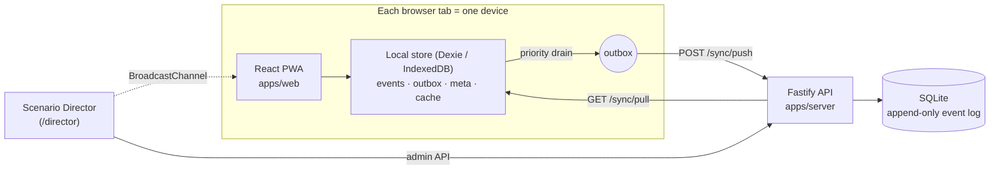

# DHRUV

**Polar operations decision support: show what a delay will break, by when someone must act, and how far to trust the data.**

DHRUV is an offline-first decision-support system for polar expedition logistics, built for Smart India Hackathon 2026, problem statement **SIH26062**. It connects cargo, inventory, personnel, assets, missions, emergencies and communications into one operational state. When something changes (a ship is delayed, a station loses its satellite link, a field team misses a check-in), DHRUV shows the chain of consequences, the deadline for each way out, and how much the underlying data can be trusted.

> **All data in this repository is synthetic** (the fictional "Season 48", 24 Jan 2027). Station coordinates are approximate public values; nothing else is real NCPOR data. The app says so on every screen.

---

## Contents

- [What it does](#what-it-does)
- [How it works](#how-it-works)
- [Repository layout](#repository-layout)
- [Quick start](#quick-start)
- [Signing in](#signing-in)
- [Running the demo](#running-the-demo)
- [Configuration](#configuration)
- [Scripts](#scripts)
- [API](#api)
- [Testing and CI](#testing-and-ci)
- [Project status](#project-status)
- [Troubleshooting](#troubleshooting)
- [Contributing](#contributing)

---

## What it does

DHRUV is built around three ideas, each visible in the interface:

1. **Show-the-math consequence trace.** A conclusion is never a black box. Each one is a list of steps: rule, inputs, formula, result. Example: container C-104's ETA slips from 2 Feb to 7 Feb → it misses the vessel's 4 Feb load cutoff → 48 kL of diesel is excluded → Maitri's fuel ratio drops to 92 / 132 = 0.697 → the station turns RED → mission F-27 is at risk.
2. **Per-lever decision windows.** Instead of "fuel runs out in N days", DHRUV lists the mitigations that still work (hold the vessel, partial airlift, defer a mission, conserve) and the last date each can be started. The latest of those is the **point of no return**.
3. **Freshness-propagated confidence.** Data age is an input, not a label. An old stock count widens the confidence band ("GREEN, could be AMBER"), stale inputs force a verification before approval, and an old position grows the uncertainty circle on the map.

Around those ideas it provides:

- **Offline-first operation.** Each station keeps working without a link. Events queue locally and sync in priority order (incidents first, attachments last) when the link returns.
- **Conflict handling.** Safety-critical disagreements (for example a skidoo marked DOWN at the station but OK at HQ) keep the conservative value and go to a human in the Review queue.
- **Human decisions.** DHRUV proposes options; only a person approves them, and the approval is recorded as an event.
- **Emergency mode.** When an incident opens: last confirmed position with its age, an uncertainty circle, nearest capable assets with ETAs, medical resources, and a verification checklist.

Roles (Build Bible section 4): **HQ Ops** (desktop, all stations), **Station Leader** (tablet, own station), **Field Lead** (mobile, own team). Emergency is a mode, not a role.

---

## How it works



- **One event log is the source of truth.** Every change is an append-only event (`LEG_DELAYED`, `STOCK_COUNTED`, `ASSET_STATUS_SET`, `DECISION_APPROVED`, ...) with a device id, a per-device sequence number, a priority tier and the time it was observed. Everything else (decisions, conflicts, incidents, positions) is derived from events.
- **The client writes locally first.** `writeEvent()` in `packages/store` is the only way the app changes state. It stores the event and queues it in the outbox in one transaction, so the device works with no connection at all.
- **Sync.** Every 3 seconds each device pushes its outbox in priority order (P0 incident … P5 attachments) and pulls other devices' events after its cursor. On a *Degraded* link it sends at most 2.5 KB per demo second; *Offline*, nothing leaves. Pushes are idempotent on `(device_id, seq)`. Failures back off 2 / 4 / 8 / 16 / 30 s and are marked stalled after 5.
- **Viewer-relative.** Each device evaluates against its own demo clock and the events it holds. An offline station and HQ can legitimately see different things until they sync, and the app shows how old each view is.
- **Merge rules** (section 9). Facts are unioned; stock is last count plus deltas (a negative result goes to review); owner fields are last-write-wins; safety-critical fields keep the conservative value and raise `CONFLICT_FLAGGED`.
- **The server** (Fastify + SQLite) is the meeting point for events. It validates each event against the role and node rules, detects conflicts, runs decision approval with lever follow-ups (holding the vessel emits `VESSEL_UPDATED` and `LEG_UPDATED`), and serves the Scenario Director's beats.
- **The engine** (`packages/engine`, rules R01–R19) is a pure `evaluate({ seed, events }, now)` that runs identically in the browser and on the server: every station, on fuel, food (from live POB), medical, spares and power, personnel and comms, with missions, levers, options, the point of no return, confidence bands, slip tolerance and the B0 baseline. The server uses it to propose decisions (Director beat 2 records the ranked options); each browser uses it for readiness, traces and what-if, on the events that device holds. Levers of an approved option are applied from the log.

How the data is stored, table by table, is in [docs/data-storage.md](docs/data-storage.md); the **Where data lives** screen (`/data`) shows it live.

The full design is in the Build Bible (SIH26062 source of truth) and its v2 amendment document.

---

## Repository layout

A pnpm workspace:

```
apps/
  web/        React 18 + Vite + Tailwind 4 PWA: screens, live device layer (src/live), design system
  server/     Fastify + better-sqlite3 API: auth, sync, conflicts, decisions, Director, OpenAPI
packages/
  shared/     Event types and zod schemas, API types, config (thresholds), conflict detection, stock rule
  store/      Client data layer: Dexie store, writeEvent, outbox drain, sync, views, Director channel
  map/        Positions, uncertainty circles, nearest capable assets, Leaflet layers, SVG schematic
  seed/       Season 48 dataset (section 13), Director beats 1–11, lever follow-ups
  engine/     evaluate() (rules R01–R19): pure, deterministic, no clock or randomness
docs/
  demo-run.md       Step-by-step demo runbook with the expected result of every beat
  data-storage.md   How data is stored: device IndexedDB, outbox, server SQLite log, what is computed
.github/workflows/ci.yml   Node 20: frozen install, typecheck, test, web build
```

| Package | What it owns |
|---|---|
| `@dhruv/shared` | The contract: `OpEvent`, every event type's payload schema, allowed roles and priority, API request/response types, `config` (sync budget, freshness thresholds, map, season calendar) |
| `@dhruv/store` | Everything the browser does with data. Also used by the server's end-to-end tests |
| `@dhruv/map` | Map logic that does not depend on React: `buildMapModel`, `nearestCapableAssets`, `uncertaintyRadiusKm`, `addMapLayers`, `renderSchematicSvg` |
| `@dhruv/seed` | `season48` (5 nodes, MV Ice Star, shipments C-104/C-107/C-112, inventory, 33 people, 17 assets, missions, levers) and `DIRECTOR_BEATS` |
| `@dhruv/server` | SQLite schema (Build Bible section 14), `/api/v1` routes (section 15), ingest and authorization, projections |
| `dhruv-frontend` | The app, in `apps/web` |

---

## Quick start

### Prerequisites

- **Node.js 20 LTS.** The workspace is pinned to `>=20 <21`, and CI runs Node 20. Newer versions work for development but print an engine warning.
- **pnpm 9.12.0**, via Corepack (included with Node):

  ```bash
  corepack enable
  ```

- A C/C++ toolchain is only needed if `better-sqlite3` has no prebuilt binary for your platform (most platforms have one).

### Install, seed, run

```bash
git clone https://github.com/revanthreddy0906/DHRUV.git
cd DHRUV
pnpm install
pnpm seed
pnpm dev
```

- `pnpm seed` creates `apps/server/dhruv.db` (SQLite) and loads the Season 48 dataset with an empty event log. Run it again whenever you want a clean start.
- `pnpm dev` starts the **API on http://localhost:4000** and the **web app on http://localhost:5173** (or the next free port, which Vite prints). The web app proxies `/api` to the API, so there is no CORS setup.

Open the web app and sign in (next section). `http://localhost:4000/health` should return `{"ok":true}`.

---

## Signing in

The login is deliberately simple (demo mode): pick a role, a station, a device id and the station's PIN.

| Role | Station | Default device id | PIN |
|---|---|---|---|
| HQ Ops | Goa HQ | `HQ-WEB-01` | `HQ-2027` |
| Station Leader | Maitri | `MAITRI-TAB-01` | `MAITRI-2027` |
| Station Leader | Bharati | `BHARATI-TAB-01` | `BHARATI-2027` |
| Field Lead | Maitri (team FT-3) | `FT3-TAB-01` | `MAITRI-2027` |

- **One browser tab is one device.** The session lives in the tab, and each device has its own local database (`dhruv-<device id>` in IndexedDB). To simulate HQ and a station at once, sign in to two tabs.
- **A device can be open in only one tab.** A second tab signing in as the same device is refused, because two copies of one device would write clashing sequence numbers.
- Field Leads land on the mobile field screen; the other roles land on the Command Center.

---

## Running the demo

The demo follows the Build Bible's runbook: a shipment slips, Maitri turns RED, the station loses its link, a field team goes overdue, the link returns and syncs in priority order, a conflict is resolved, and HQ approves holding the vessel.

1. Sign in to four tabs: **Director** as HQ Ops with device id `HQ-WEB-02`, **HQ** as `HQ-WEB-01`, **Maitri** as `MAITRI-TAB-01`, and **Field Lead** as `FT3-TAB-01`.
2. Open **`/director`** (or add `?director=1` to any URL) in the Director tab. The panel lists the device tabs it can reach and which tab each beat needs.
3. Press **Reset to Start**, then run beats 1–11 while watching the HQ and Maitri tabs.

**[docs/demo-run.md](docs/demo-run.md)** lists every beat and exactly what each screen should show (for example "Maitri offline: INC-01, last confirmed 9 h ago, circle 27 km, HX-1 ≈ 11 min").

Controls available in every signed-in tab:

- **Demo clock** (top bar): +1 h, +6 h, +30 h and Reset. Jumps are absolute and per device.
- **Simulated link** (top bar): Online / Degraded / Offline for this device's station.
- **SYNC counter** (top bar): opens the Sync drawer with the outbox by priority tier, the byte budget, Drain now and Retry stalled.

To review every screen in every designed state without a server, open **`/screens`** without signing in. The screens then show the design's reference data and say "Preview · not signed in".

---

## Configuration

The server reads environment variables; it does not load `.env` files. See `apps/server/.env.example`.

| Variable | Default | Meaning |
|---|---|---|
| `PORT` | `4000` | API port |
| `DEMO_MODE` | `true` | Enables the demo PINs, the Director and admin endpoints, and relaxes the future-timestamp check (demo time is 2027) |
| `JWT_SECRET` | built-in development key | **Required when `DEMO_MODE` is not `true`**; the server refuses to start without it |
| `DHRUV_DB_FILE` | `dhruv.db` | SQLite file, relative to `apps/server` |
| `CORS_ORIGINS` | `http://localhost:5173,http://127.0.0.1:5173` | Browser origins allowed to call the API directly (not needed when going through the Vite proxy) |
| `ANTHROPIC_API_KEY` | none | Reserved for the "AI explain" button; not used yet |

The web app reads `DHRUV_API_URL` at dev-server start (default `http://localhost:4000`) to decide where `/api` is proxied.

Thresholds and synthetic parameters (sync budget, freshness classes, uncertainty drift, season calendar, check-in interval) live in `packages/shared/src/config.ts`.

---

## Scripts

Run from the repository root:

| Command | What it does |
|---|---|
| `pnpm dev` | API (watch mode) and web app together |
| `pnpm seed` | Reset the database to Start (Season 48, empty event log) |
| `pnpm test` | All test suites (server, store, map) |
| `pnpm typecheck` | TypeScript across every package and the web app |
| `pnpm build` | Build the packages that have a build step |
| `pnpm --filter dhruv-frontend build` | Production build of the PWA into `apps/web/dist` |
| `pnpm --filter @dhruv/server dev` | API only |
| `pnpm --filter dhruv-frontend dev` | Web app only |
| `pnpm --filter @dhruv/map demo` | Standalone map preview on http://localhost:5190 |

---

## API

Base path **`/api/v1`**, JSON only, 1 MB body limit. Errors use one shape: `{ "error": { "code", "message", "details?" } }`. The full contract is published by the running server at **`/api/v1/openapi.yaml`**, and a test fails if it drifts from the routes.

| Method and path | Purpose | Who |
|---|---|---|
| `POST /auth/login` | Device, role, node and PIN → JWT | anyone |
| `GET /state` | Seed plus the full event log and cursor (first load) | signed in |
| `POST /sync/push` | Push a batch of events; each is accepted, duplicate or rejected with a reason | signed in |
| `GET /sync/pull?since=&limit=` | Other devices' events after the cursor | signed in |
| `POST /events` · `GET /events` | Write one event · audit query | signed in |
| `POST /decisions/:id/approve` · `/reject` | Human decision; approval emits the chosen levers' follow-ups | HQ Ops, or the station's Station Leader for station-level levers |
| `POST /scenarios/run` | What-if on the engine: the log plus overlay events, nothing stored (the app runs the same engine locally) | signed in |
| `POST /admin/seed` · `POST /admin/director/:beat` | Reset to Start · run a server-side Director beat | HQ Ops, demo mode only |

Every write is checked against the Build Bible's permission rules: the event type must be allowed for the role, a Station Leader writes only for their own station (including the record the event changes), and `actor_role` must match the signed-in role.

---

## Testing and CI

```bash
pnpm typecheck
pnpm test
```

- **Engine (80 tests)**: every rule R01–R19 in isolation, determinism, food by POB.
- **Server (97 tests)**: auth and device binding, idempotent push and pull, the log epoch after a reset, role and node enforcement, conflict detection, decisions proposed from the engine and approved with follow-ups (online and synced offline), the OpenAPI drift check, a push performance budget, an end-to-end run of Director beats 1–11 with three simulated devices, and the **golden-number harness** (`src/golden`): the Build Bible's T-ENG, T-FRESH, T-SYNC, T-BASE and T-WHATIF cases on season 48. All 29 pass. A case marked `known` would run as `it.fails` with its reason, and `GOLDEN_STRICT=1` runs such cases as ordinary tests.
- **Store (37 tests)**: write path, clock, priority drain and byte budget, backoff and stall, bootstrap and epoch reset, and the read-side views.
- **Map (19 tests)**: distances, uncertainty circles, nearest capable assets, Leaflet layers, schematic escaping.
- **Web (8 tests)**: the hero demo through the engine and the screen adapter (options, PNR, Bharati, inventory and roles).

CI (`.github/workflows/ci.yml`) runs on pushes to `main`, `develop` and `feature/**` and on pull requests: Node 20, `pnpm install --frozen-lockfile`, typecheck, test, and the web build.

---

## Project status

| Area | Status |
|---|---|
| Event log, sync, offline outbox, priority drain, conflicts, decisions | Working, tested, live in the app |
| Season 48 seed data (section 13) | Done. Values the Bible leaves open are marked `FILLED` in `packages/seed/src/season48.ts` |
| Command Center: decision queue, point of no return, incident strip, timeline, sync status | Live from events |
| Decision Detail: approve and reject, online or queued offline | Live |
| Incident screen and map: position, circle, nearest assets, conflicts, escalation | Live (NASA Blue Marble tiles, schematic fallback) |
| Sync drawer, Review queue, Audit, Scenario Director | Live |
| Engine: every station and dimension, missions, levers and options, PNR, bands, slip tolerance, B0 | Working. All 29 golden cases pass |
| Readiness, options, traces, Cargo, Inventory, Personnel and Missions, what-if | Live from the engine on each device's events. Signed out, `/screens` shows the design reference states |
| Manual data entry | Inventory: Issue, Receive and Count (Station Leader; HQ may count). Cargo: HQ creates shipments (`SHIPMENT_CREATED`) and records leg delays with an engine preview. Personnel: set status, move people between stations. Every form writes one event through `device.write()` |
| AI explain · Print brief | AI explain not wired yet; Print brief prints the Incident screen, and is not wired on Decision Detail |

**R01 horizon.** The requirement covers a fixed horizon, from the start of the season plan (24 Jan) to the next resupply, because stock changes only through counts, issues and receipts, never through elapsed time. This is what the Bible's golden numbers assume (R = 132.0 kL throughout the demo).

**Values the Bible leaves open** are `FILLED` in `packages/seed/src/season48.ts` and `packages/shared/src/config.ts` (for example the 1 kL threshold below which a mission is not put at risk, and diesel burn per km for ground vehicles).

---

## Troubleshooting

- **`pnpm: command not found`, or the root scripts fail with it.** Run `corepack enable` once. The root scripts call `pnpm` internally, so `corepack pnpm dev` alone is not enough.
- **`better-sqlite3 … was compiled against a different Node.js version`.** You switched Node versions after installing. Run `pnpm rebuild better-sqlite3`, or reinstall with the Node version you use to run.
- **Port 5173 is taken.** Vite picks the next free port and prints it; the proxy still works. Only direct browser calls to the API (without the proxy) need `CORS_ORIGINS` updated.
- **"… is open in another tab".** That device is already signed in to another tab. Use that tab, or sign in here with a different device id.
- **A Director beat says "no response from …".** The device that beat needs is not open and signed in.
- **Map tiles do not load** (offline, blocked). The map switches to the schematic by itself; nothing else is affected.
- **Start over.** Press *Reset to Start* in the Director, or stop the servers, run `pnpm seed`, and reload the tabs.

---

## Contributing

- Branch from `develop` (`feature/<name>`) and open pull requests into `develop`; CI must pass.
- The Build Bible (SIH26062 source of truth) and its v2 amendments are the specification. Event types, the API contract and the schema are locked; change them only together with the team.
- Every state change goes through an event (`writeEvent` on the client, `ingest` on the server). Readiness and ratios come from the engine; the UI must not compute its own.
- Team areas (v2 C12): **A** engine and seed data · **B** frontend · **C** backend, sync and map · **E** docs, presentation, QA and secondary screens.

---

*DHRUV is a hackathon prototype for decision support. It does not replace operational procedures, and no data in it is real.*
