<div align="center">

# DHRUV

**Decision support for polar logistics. It shows what a delay will break, by when someone must act, and how far to trust the data.**

Smart India Hackathon 2026 · Problem statement **SIH26062** · Offline-first · Deterministic · Explainable

[](https://github.com/revanthreddy0906/DHRUV/actions/workflows/ci.yml)


</div>

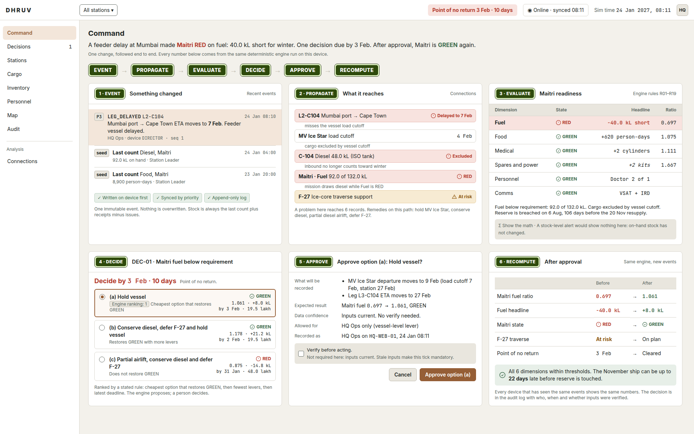

<sub>One change followed end to end on the Season 48 demo. This is a composite: each panel reproduces the app's own screen and numbers, which are shown in the [screenshots](#screens) below.</sub>

---

## Contents

1. [The problem](#the-problem)
2. [What DHRUV does](#what-dhruv-does)
3. [Screens](#screens)
4. [System architecture](#system-architecture)
5. [From one event to a decision](#from-one-event-to-a-decision)
6. [The readiness engine](#the-readiness-engine)
7. [Offline-first sync and conflicts](#offline-first-sync-and-conflicts)
8. [Trust in data: freshness and confidence](#trust-in-data-freshness-and-confidence)
9. [Decisions and roles](#decisions-and-roles)
10. [Validation on real incidents](#validation-on-real-incidents)
11. [Repository layout](#repository-layout)
12. [Quick start](#quick-start)
13. [Running the demo](#running-the-demo)
14. [Configuration](#configuration)
15. [API](#api)
16. [Testing and CI](#testing-and-ci)
17. [Project status and scope](#project-status-and-scope)
18. [Troubleshooting](#troubleshooting)
19. [Contributing](#contributing)
20. [Documentation index](#documentation-index)

---

## The problem

India's Antarctic stations, **Maitri** and **Bharati**, depend on one resupply window a year. The supply chain is planned from Goa HQ and runs through a single corridor:

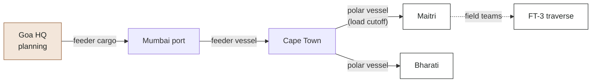

A single slip cascades. A feeder ship is late, the cargo misses the polar vessel's load cutoff, winter diesel falls short, and a field mission becomes unsafe. Today this is tracked in spreadsheets, e-mail and radio calls, which leaves three gaps:

| Gap | What happens today |
|---|---|
| **Consequences are invisible** | The stock sheet still says "92 kL diesel on hand" after the cargo that would have made it enough has been excluded. A stock-level alert stays silent. |
| **Deadlines are implicit** | Nobody sees the *point of no return*: the last date on which some option (hold the vessel, airlift, conserve, defer a mission, evacuate) can still restore a safe state. |
| **Data is old, links are poor** | Stations run on low-bandwidth VSAT and Iridium that drop for hours or days. Numbers arrive late, nobody marks how far to trust them, and two devices can report contradictory safety data. |

## What DHRUV does

When anything changes, DHRUV answers three questions on one screen:

| Question | How DHRUV answers it |
|---|---|
| **What breaks?** | Readiness for each station across six dimensions (fuel, food, medical, spares and power, personnel, comms) as **GREEN / AMBER / RED**, each with a plain-language reason: *"Fuel below requirement: 92.0 of 132.0 kL. Cargo excluded by vessel cutoff."* |
| **By when must we act?** | Every mitigation has its own deadline. The latest one that still restores GREEN is the **point of no return**, shown as a countdown. |
| **How far can we trust it?** | Every number carries its age. Older data widens the confidence band ("GREEN, could be AMBER"), and stale inputs require **"Verify before acting."** before an approval. |

Three design commitments run through the whole system:

1. **Show the math.** Every number opens its calculation in one click: rule, inputs, formula and result, with the engine's own trace text. A baseline line shows what a plain stock alert would have said (usually: nothing).
2. **Humans decide.** The engine proposes and ranks options by a stated rule. Only a person approves, the approval is an event, and it records who, when, on which device, and whether the inputs were verified.
3. **Offline first.** Every device keeps working with no link. Events are written locally, then synced in safety-priority order when the link allows.

Roles: **HQ Ops** (desktop, all stations), **Station Leader** (tablet, own station), **Field Lead** (phone, own team). Emergency is a mode, not a role.

---

## Screens

All screenshots come from the running app on the Season 48 demo data.

| | |
|---|---|
| **Command Center (L1).** Status sentence, stations, a ranked "Needs attention" queue, the network position and the season window.<br/>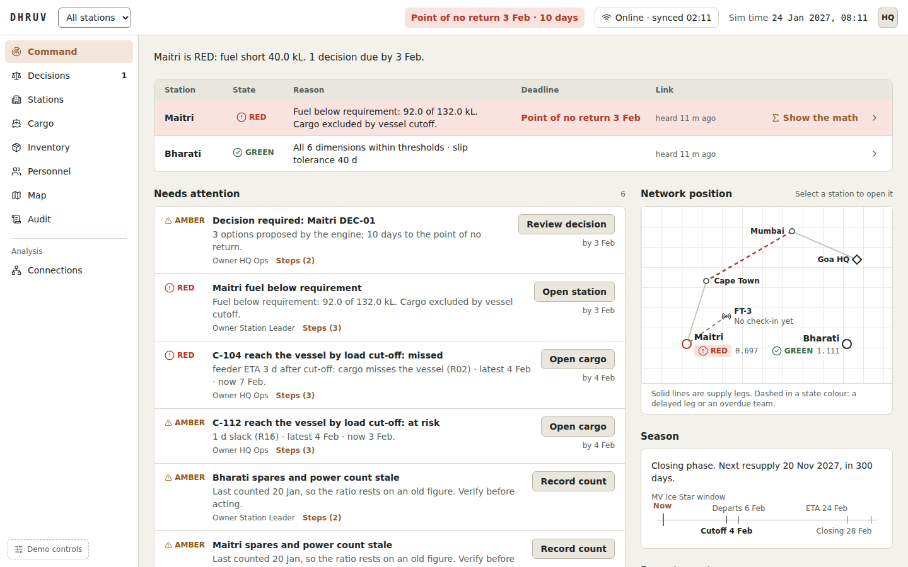 | **Station page (L2).** The six dimensions with headline margins, ratio, reason, data age and "Show the math" on every row.<br/>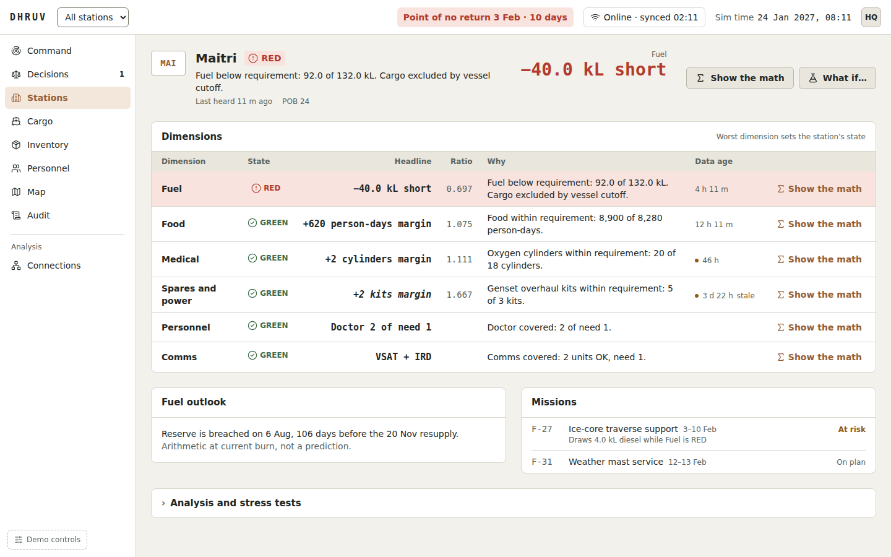 |
| **Decision.** The consequence chain, then the options side by side: restores GREEN?, fuel after, last date to act, slack, cost and data confidence.<br/>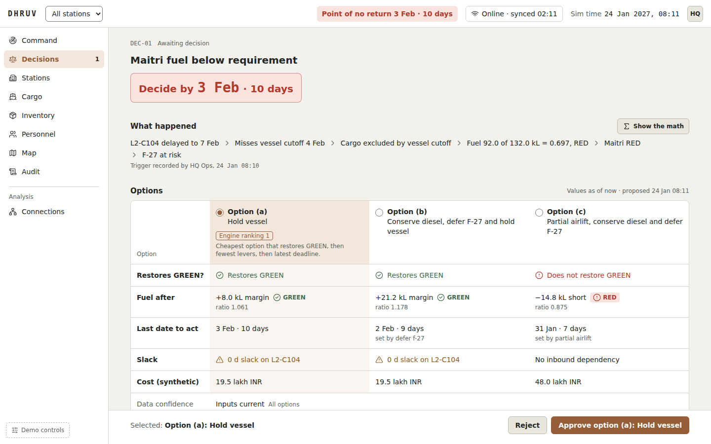 | **Approval.** Before anything is recorded: what will be written, the expected result, and who is recording it.<br/>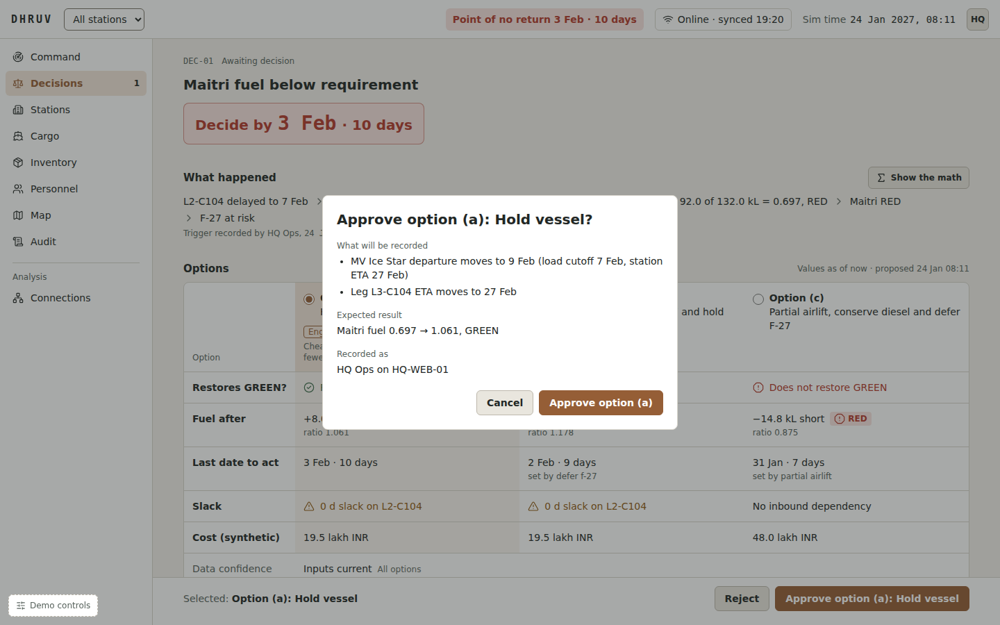 |
| **Connections.** A knowledge graph from a record to everything a problem there reaches, with the remedies on that path.<br/>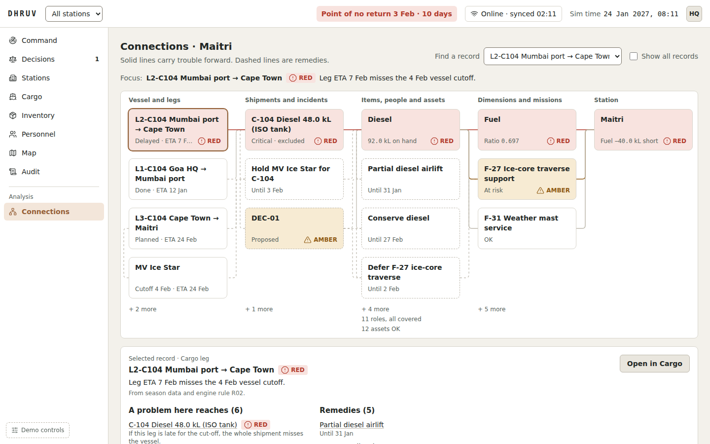 | **Offline station.** Maitri with no link: local operations continue, 5 events pending, other devices' data dated.<br/>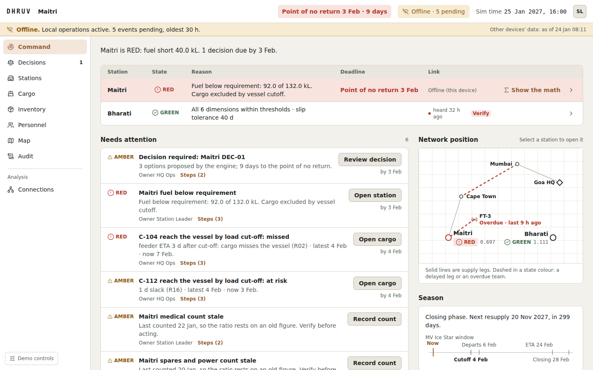 |
| **Incident.** Last confirmed position and its age, uncertainty circle, snapshot with ages, candidate responders, escalation and print brief. Map tiles fall back to a schematic.<br/>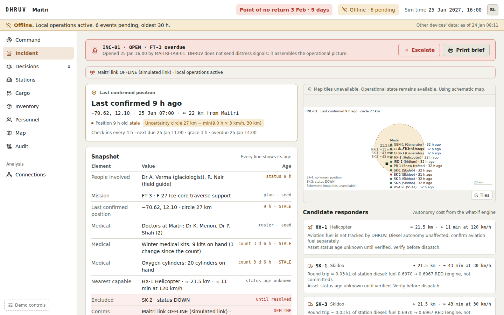 | **Field Lead (phone) and Scenario Director.** Big-button check-in with overdue state; the Director drives the demo across tabs.<br/>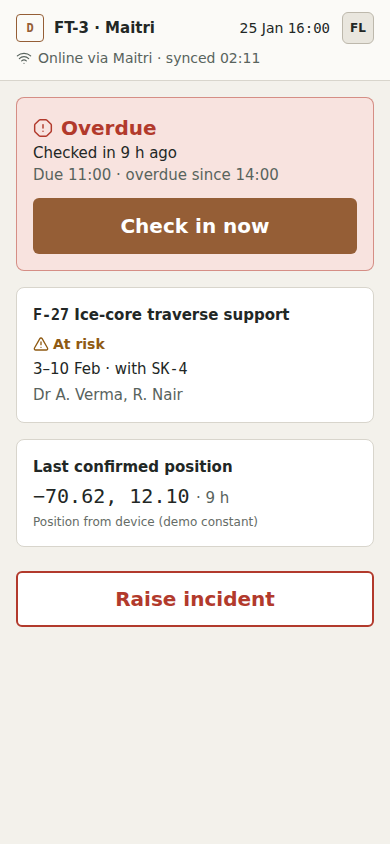 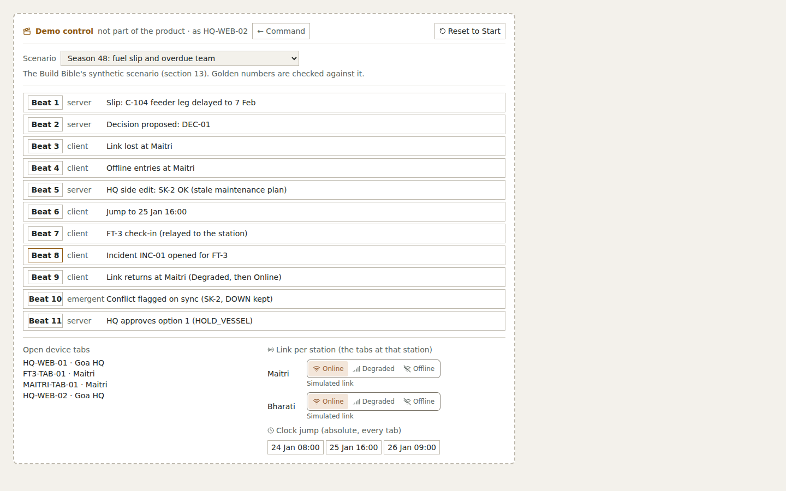 |

Other screens: **Cargo** (leg timelines anchored on the vessel cutoff, back-scheduled milestones), **Inventory** (transactions with a consequence preview and plausibility guard, stocktake, per-item stock card and ledger), **Personnel and missions** (role coverage, person and asset records with history), **Map**, **Audit** (append-only log and conflict review queue), **Sync drawer** (outbox by priority tier) and **Where data lives** (`/data`, the storage explained live).

---

## System architecture

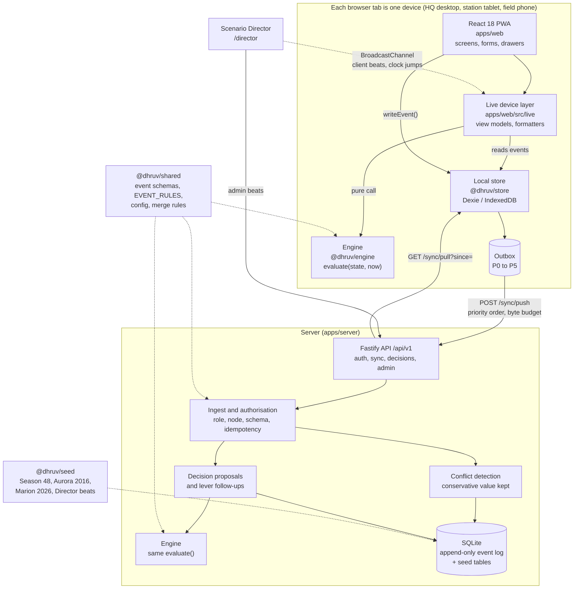

**The ideas behind it**

- **One event log is the source of truth.** Every change is an immutable event (`LEG_DELAYED`, `STOCK_COUNTED`, `ASSET_STATUS_SET`, `DECISION_APPROVED` and so on) with a device id, a per-device sequence number, a priority tier and the time it was observed. Nothing is stored as "the stock level": stock is always the last count plus receipts minus issues.
- **The same engine runs everywhere.** `evaluate({ seed, events }, now)` is a pure function with no clock and no randomness. Two devices that hold the same events show the same numbers, and the server uses the same code to propose decisions.
- **Views are relative to the viewer.** Each device evaluates against its own clock and the events it holds. An offline station and HQ can see different things until they sync, and every view says how old it is.
- **The client writes locally first.** `writeEvent()` stores the event and queues it in the outbox in one transaction, so no screen depends on the network.

### Package dependencies

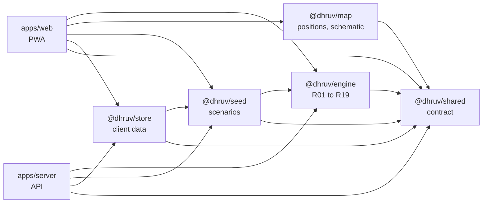

`@dhruv/shared` is the locked contract; the engine depends on nothing else, which is what keeps it deterministic and testable.

### Technology

| Layer | Choice | Why |
|---|---|---|
| Language | TypeScript (strict), pnpm workspace | One type system from event schema to screen |
| Web | React 18, Vite, Tailwind 4, lucide-react, installable PWA | Runs on HQ desktops, station tablets and field phones; works offline |
| Local data | Dexie on IndexedDB | Durable per-device log and outbox in the browser |
| Maps | Leaflet with NASA GIBS Blue Marble tiles, SVG schematic fallback | No paid map APIs; keeps working when tiles cannot load |
| Server | Fastify, better-sqlite3, zod | Small, fast, append-only log in one file |
| Validation | zod schemas shared by client and server | The same event is checked on the device and again on the server |
| Tests | Vitest | 433 tests across engine, store, map, server and web |

---

## From one event to a decision

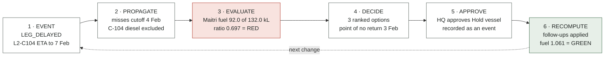

| Step | What happens | Where in the code |
|---|---|---|
| **Event** | HQ records that the feeder leg is late. The event is written on the device, queued, synced and appended to the server log. | `packages/store` `writeEvent`, `apps/server/src/sync/ingest.ts` |
| **Propagate** | The cargo is checked against the vessel's load cutoff; excluded cargo no longer counts as inbound; missions that draw on it are marked. | Engine rules R02, R07; `knowledgeGraph` for Connections |
| **Evaluate** | Requirement to the next resupply, availability, ratio and state per item, dimension and station, with a trace for every number. | Rules R01 to R06, R12 to R19 |
| **Decide** | Levers and their deadlines, option generation, ranking, point of no return. | Rules R08 to R11 |
| **Approve** | A person approves one option. Roles are enforced; stale inputs need the verify tick. The server emits the option's follow-up events. | `apps/server/src/sync/decisions.ts` |
| **Recompute** | Every device re-evaluates with the new events and converges on the same answer. | `evaluate()` on each device |

A plain stock-level alert (baseline B0, rule R18) shows **no alert** through all of this, because the 92.0 kL on hand never changed. That contrast is the core evidence for the approach.

---

## The readiness engine

`packages/engine` implements 19 explicit rules. It never uses a weighted score: every state comes from a ratio and fixed thresholds (**GREEN ≥ 1.05**, **AMBER 0.95 to < 1.05**, **RED < 0.95**).

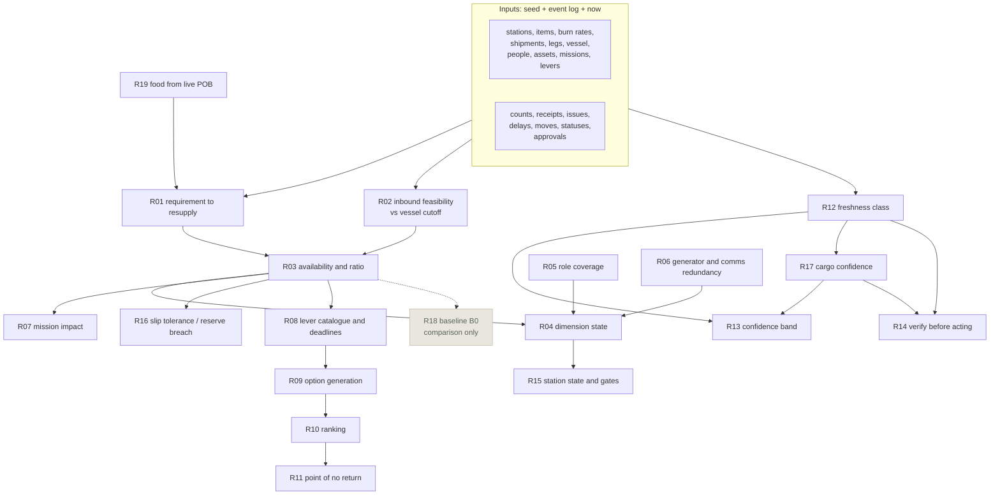

| Rule | What it computes |
|---|---|
| R01 | Requirement to the next resupply, per item, from the season's phase profile plus reserve |
| R02 | Inbound feasibility: leg ETA against the vessel load cutoff, vessel ETA against the closing date, with slack days |
| R03 | Availability, ratio and state per item |
| R04 | Dimension state: the worst item |
| R05 | Personnel coverage per critical role (need + 1 for GREEN) |
| R06 | Generator and comms redundancy, same pattern |
| R07 | Mission impact: a fuel-drawing mission with RED fuel is at risk; a missing person or asset blocks it |
| R08 | Lever catalogue: which levers exist for the gap, and each one's deadline (cutoff minus lead time) |
| R09 | Option generation: combinations of up to three levers, each re-evaluated |
| R10 | Ranking: cheapest option that restores GREEN, then fewest levers, then latest deadline |
| R11 | Point of no return: the latest deadline among options that reach GREEN |
| R12 | Freshness class per input (FRESH, AGING, STALE, CRITICAL), with thresholds per data type |
| R13 | Asymmetric confidence band: stock only depletes while unobserved, so uncertainty is one-sided |
| R14 | Verify first: an option that depends on stale data or uncertain cargo needs a ticked verification |
| R15 | Station state: the worst dimension; an open incident or unresolved safety conflict adds a gate |
| R16 | Slip tolerance: how many days late the ship can be before reserve is touched, or the reserve-breach date |
| R17 | Cargo feasibility confidence: an old ETA report with little slack makes the inbound UNCERTAIN |
| R18 | Baseline B0: what a plain stock alert would show, for comparison; never drives state |
| R19 | Food requirement from the live number of people on station |

Every rule leaves trace steps such as `[R03] Diesel availability vs requirement: 92.0 / 132.0 = 0.697 -> RED`. The UI formats these; it never computes readiness itself.

---

## Offline-first sync and conflicts

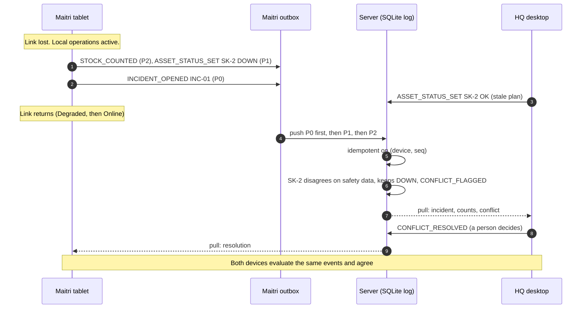

| Priority | Events | While Degraded |
|---|---|---|
| **P0** | Incidents opened and updated | Sent first |
| **P1** | Person status, check-ins, moves, asset status, conflicts | Sent |
| **P2** | Stock counts, receipts, issues, burn-rate changes | Sent |
| **P3** | Shipments, legs, vessel, decisions | Sent |
| **P4** | Missions, assignments, routine stock lines | Sent |
| **P5** | Attachments | Held until Online |

- **Budget.** On a Degraded link the outbox sends at most 2.5 KB per demo second (a 20 kbps link); Offline, nothing leaves. Failures back off 2, 4, 8, 16, 30 s and are marked stalled after 5.
- **Idempotent.** Each event is unique on `(device_id, seq)`, so a resend is a no-op.
- **Merge rules.** Facts are unioned (class A). Stock is last count plus deltas (class B, a negative result goes to review). Owner fields are last write wins (class C). Safety-critical fields keep the **most conservative** value and raise `CONFLICT_FLAGGED` for a person to resolve (class CS).

How the data is stored, table by table, is in [docs/data-storage.md](docs/data-storage.md); the `/data` screen shows it live.

---

## Trust in data: freshness and confidence

Data age is an input to the calculation, not a label on it.

| Data type | FRESH | AGING | STALE | CRITICAL |
|---|---|---|---|---|
| Stock count | < 24 h | < 72 h | < 7 d | ≥ 7 d |
| Cargo ETA report | < 12 h | < 48 h | < 7 d | ≥ 7 d |
| Position | < 1 h | < 6 h | < 24 h | ≥ 24 h |
| Link contact | < 1 h | < 6 h | < 24 h | ≥ 24 h |
| Asset status | < 6 h | < 24 h | < 72 h | ≥ 72 h |

What freshness changes:

- **The confidence band widens** by class (1 %, 3 %, 6 %, 12 %), on the low side only. A ratio of 1.06 with an old count reads "GREEN, could be AMBER".
- **Inbound cargo becomes UNCERTAIN** when its ETA report is stale and its slack to the cutoff is 2 days or less; the band's low side is then computed without it.
- **A position's uncertainty circle grows** at 3 km per hour of age, capped at 30 km ("Last confirmed 9 h ago, circle 27 km").
- **Approval requires "Verify before acting."** when an option depends on stale or uncertain inputs. The tick is recorded in the approval.

---

## Decisions and roles

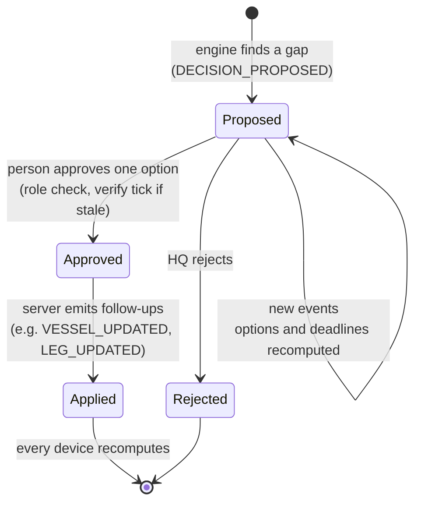

| Role | Sees | Can do |
|---|---|---|
| **HQ Ops** | All stations | Cargo, shipments and ETAs, stock counts, personnel moves, approve any option (including vessel and evacuation levers), reject, resolve conflicts |
| **Station Leader** | Own station | Counts, issues and receipts, personnel and asset status, incidents, approve **station-level** options (for example Conserve), resolve conflicts |
| **Field Lead** | Own team | Check-ins, raise an incident, set team member status |

Allowed actions come from one table, `EVENT_RULES` in `packages/shared`. The device checks it before writing and the server checks it again, together with the station the event touches. A control a role cannot use is disabled with its reason printed.

---

## Validation on real incidents

Beyond the Season 48 core scenario, the Scenario Director replays two documented Antarctic logistics crises, with the real dates and a source on every beat. Quantities are illustrative; the claim is the timing arithmetic, not a prediction.

| Scenario | What DHRUV shows | Run-through |
|---|---|---|
| **Season 48** (synthetic) | A feeder slip makes Maitri's winter diesel RED with a 10-day point of no return, while a stock alert stays silent. Offline station, overdue field team, incident, priority sync, safety conflict, approval. | [docs/demo-run.md](docs/demo-run.md) |
| ***Aurora Australis* aground at Mawson, 2016** | Cargo stranded aboard, 37 expeditioners brought ashore, food readiness collapsing, a replacement shipment arranged. | [docs/run-through-aurora-2016.md](docs/run-through-aurora-2016.md) |
| **Marion Island polar-diesel crisis, 2026** | "Fuel lasts to about 20 May" becomes "the evacuation must start by 13 May, or 18 May if the station conserves", with verification required because the station link was down. The real order came on 14 May. | [docs/run-through-marion-2026.md](docs/run-through-marion-2026.md) |

Each scenario has a replay test in `apps/server/src/golden` that asserts the documented numbers beat by beat.

---

## Repository layout

```
apps/
  web/          React PWA: screens, live device layer (src/live), components, formatters, theme
  server/       Fastify + SQLite API: auth, sync, ingest, conflicts, decisions, Director, OpenAPI
packages/
  shared/       Event types and zod schemas, EVENT_RULES, API types, config, conflicts, stock rule
  engine/       evaluate(): rules R01 to R19, robustness, knowledge graph. Pure and deterministic
  store/        Client data layer: Dexie store, writeEvent, outbox drain, sync, views, Director channel
  map/          Positions, uncertainty circles, nearest capable assets, Leaflet layers, SVG schematic
  seed/         Season 48, Aurora 2016 and Marion 2026 scenarios, Director beats, lever follow-ups
docs/
  spec.md                        Specification (Build Bible, with the v2 amendments)
  demo-run.md                    Demo runbook: every beat and what each screen should show
  data-storage.md                Device IndexedDB, outbox, server SQLite log, what is computed
  record-history.md              Stock card, person and asset history
  logistics-landscape.md         How other logistics platforms work, with sources, and what DHRUV adopted
  run-through-aurora-2016.md     Real incident 1, beat by beat
  run-through-marion-2026.md     Real incident 2, beat by beat
  ui-redesign/                   Design rules (ISA-101 calm UI), tokens, phase notes
  images/                        Screenshots used in this README
.github/workflows/ci.yml         Node 20: frozen install, typecheck, test, web build
```

---

## Quick start

**Prerequisites:** Node.js 20 LTS (the workspace is pinned to `>=20 <21`; newer versions work with an engine warning) and pnpm 9.12.0 through Corepack:

```bash
corepack enable
```

A C/C++ toolchain is needed only if `better-sqlite3` has no prebuilt binary for your platform.

**Install, seed and run:**

```bash
git clone https://github.com/revanthreddy0906/DHRUV.git
cd DHRUV
pnpm install
pnpm seed          # creates apps/server/dhruv.db with Season 48 and an empty event log
pnpm dev           # API on http://localhost:4000, web app on http://localhost:5173
```

The web app proxies `/api` to the API, so no CORS setup is needed. `http://localhost:4000/health` returns `{"ok":true}`.

**Sign in** (demo mode: role, station, device id and the station PIN):

| Role | Station | Device id | PIN |
|---|---|---|---|
| HQ Ops | Goa HQ | `HQ-WEB-01` | `HQ-2027` |
| Station Leader | Maitri | `MAITRI-TAB-01` | `MAITRI-2027` |
| Station Leader | Bharati | `BHARATI-TAB-01` | `BHARATI-2027` |
| Field Lead | Maitri (team FT-3) | `FT3-TAB-01` | `MAITRI-2027` |

- **One browser tab is one device**, with its own local database (`dhruv-<device id>` in IndexedDB). A device can be open in only one tab, because two copies would write clashing sequence numbers.
- Field Leads land on the phone screen; other roles land on the Command Center.

---

## Running the demo

1. Sign in to four tabs: **Director** as HQ Ops with device id `HQ-WEB-02`, **HQ** as `HQ-WEB-01`, **Maitri** as `MAITRI-TAB-01`, and **Field Lead** as `FT3-TAB-01`.
2. In the Director tab open **`/director`**, pick a scenario and press **Reset to Start**.
3. Run the beats while watching the other tabs:

| Beat | Season 48 |
|---|---|
| 1 | C-104 feeder leg delayed to 7 Feb: Maitri fuel turns RED |
| 2 | The engine proposes DEC-01 with three ranked options |
| 3 to 4 | Maitri loses its link and keeps recording offline |
| 5 | HQ marks skidoo SK-2 OK from a stale plan |
| 6 to 7 | Clock jumps to 25 Jan 16:00; FT-3 check-in relayed to the station |
| 8 | Incident INC-01 opened for FT-3 |
| 9 | The link returns: Degraded, then Online; the queue drains by priority |
| 10 | SK-2 conflict flagged on sync; DOWN is kept for review |
| 11 | HQ approves option 1, Hold vessel: Maitri is GREEN again |

[docs/demo-run.md](docs/demo-run.md) lists exactly what every screen should show at each beat. `pnpm seed aurora2016` or `pnpm seed marion2026` starts the server on a real-incident scenario.

**Demo controls** (the dashed button at the bottom left, or **Shift+D**) hold everything that is simulation rather than product: view as role, the simulated link for this device, clock jumps for this device, and the link to the Director. The top bar shows only product state: the point of no return, the sync status (which opens the Sync drawer) and the sim time.

Signed out, **`/screens`** shows every screen in its designed states with reference data.

---

## Configuration

The server reads environment variables (it does not load `.env` files; see `apps/server/.env.example`).

| Variable | Default | Meaning |
|---|---|---|
| `PORT` | `4000` | API port |
| `DEMO_MODE` | `true` | Enables demo PINs, the Director and admin endpoints, and relaxes the future-timestamp check (demo time is 2027) |
| `JWT_SECRET` | development key | **Required when `DEMO_MODE` is not `true`**; the server refuses to start without it |
| `DHRUV_DB_FILE` | `dhruv.db` | SQLite file, relative to `apps/server` |
| `CORS_ORIGINS` | `http://localhost:5173,http://127.0.0.1:5173` | Origins allowed to call the API directly (not needed through the Vite proxy) |

The web app reads `DHRUV_API_URL` at dev-server start (default `http://localhost:4000`). Thresholds and synthetic parameters (sync budget, freshness classes, drift, season calendar, check-in interval) live in `packages/shared/src/config.ts`.

| Command | What it does |
|---|---|
| `pnpm dev` | API (watch mode) and web app together |
| `pnpm seed [scenario]` | Reset the database to Start (`season48` by default, or `aurora2016`, `marion2026`) |
| `pnpm test` | Every test suite |
| `pnpm typecheck` | TypeScript across every package and app |
| `pnpm --filter dhruv-frontend build` | Production build of the PWA into `apps/web/dist` |
| `pnpm --filter @dhruv/map demo` | Standalone map preview on http://localhost:5190 |

---

## API

Base path **`/api/v1`**, JSON only, 1 MB body limit. Errors use one shape: `{ "error": { "code", "message", "details?" } }`. The running server publishes the full contract at **`/api/v1/openapi.yaml`**, and a test fails if it drifts from the routes.

| Method and path | Purpose | Who |
|---|---|---|
| `POST /auth/login` | Device, role, node and PIN to a device-bound JWT | anyone |
| `GET /state` | Seed plus the full event log and cursor (first load) | signed in |
| `POST /sync/push` | A batch of events; each is accepted, duplicate or rejected with a reason | signed in |
| `GET /sync/pull?since=&limit=` | Other devices' events after the cursor | signed in |
| `POST /events` · `GET /events` | Write one event · audit query | signed in |
| `POST /decisions/:id/approve` · `/reject` | Human decision; approval emits the chosen levers' follow-ups | HQ Ops, or the station's leader for station-level levers |
| `POST /scenarios/run` | What-if: the log plus overlay events through the engine, nothing stored | signed in |
| `GET /storage` | Row counts and layout behind the "Where data lives" screen | signed in |
| `POST /admin/seed` · `POST /admin/director/:beat` · `GET /admin/scenario` | Reset to Start · run a server-side Director beat · current scenario | HQ Ops, demo mode only |

---

## Testing and CI

```bash
pnpm typecheck
pnpm test
```

| Suite | Tests | Covers |
|---|---:|---|
| Engine | 97 | Every rule R01 to R19 in isolation, determinism, food by POB, robustness, knowledge graph |
| Server | 127 | Auth and device binding, idempotent push and pull, role and node enforcement, conflicts, decisions and follow-ups (online and offline), OpenAPI drift, performance budget, an end-to-end offline round trip, and the **golden-number harness**: 29 of 29 Build Bible cases (T-ENG, T-FRESH, T-SYNC, T-BASE, T-WHATIF), plus Aurora 2016 and Marion 2026 replays |
| Web | 152 | View models, formatters, the hero demo through the engine and screen adapters, network view |
| Store | 38 | Write path, clock, priority drain and byte budget, backoff and stall, bootstrap, epoch reset, views |
| Map | 19 | Distances, uncertainty circles, nearest capable assets, Leaflet layers, schematic escaping |
| **Total** | **433** | |

CI (`.github/workflows/ci.yml`) runs on pushes to `main`, `develop` and `feature/**` and on every pull request: Node 20, `pnpm install --frozen-lockfile`, typecheck, test and the web build.

---

## Project status and scope

| Area | Status |
|---|---|
| Event log, offline outbox, priority sync, conflicts, decisions with follow-ups | Working, tested, live in the app |
| Engine R01 to R19: every station and dimension, missions, levers, options, point of no return, bands, slip tolerance, B0 | Working; 29 of 29 golden cases pass |
| Command, Station, Decision, Cargo, Inventory, Personnel, Map, Incident, Audit, Connections, Field Lead, Director | Live from the engine on each device's own events |
| Data entry | Inventory issue, receive and count with consequence preview and plausibility guard; HQ shipments and leg delays; personnel status and moves; every form writes one event |
| Real-incident replays | Aurora 2016 and Marion 2026, each with a replay test |
| "Explain this alert" | Plain-language explanation generated from the engine's trace by template, labelled as derived from the engine |

**Scope and honesty.** All data is synthetic demonstration data (the fictional Season 48, from 24 Jan 2027); station coordinates are approximate public values, and nothing is operational NCPOR data. Thresholds, costs and quantities are illustrative. DHRUV does not send distress signals and does not replace operational procedures. Production use would need real station data, authentication integrated with existing systems, and field trials over actual satellite links.

---

## Troubleshooting

- **`pnpm: command not found`.** Run `corepack enable` once; the root scripts call `pnpm` internally.
- **`better-sqlite3 … was compiled against a different Node.js version`.** Run `pnpm rebuild better-sqlite3`, or reinstall with the Node version you run.
- **Port 5173 is taken.** Vite picks the next free port and prints it; the proxy still works.
- **"… is open in another tab".** That device is signed in elsewhere; use that tab or another device id.
- **A Director beat says "no response from …".** The device that beat needs is not open and signed in.
- **Map tiles do not load.** The map switches to the schematic by itself; nothing else is affected.
- **Start over.** Press *Reset to Start* in the Director, or stop the servers, run `pnpm seed` and reload the tabs.

---

## Contributing

- Branch from `develop` and open pull requests into `develop`; CI must pass.
- The specification ([docs/spec.md](docs/spec.md)) is the source of truth. Event types, the API contract and the schema are locked; change them only with the team.
- Every state change goes through an event (`writeEvent` on the client, `ingest` on the server). Readiness, ratios and deadlines come from the engine; the UI formats them and never computes its own.
- UI rules (calm ISA-101 colour discipline, one fact in one place, state as word plus icon, WCAG AA) are in [docs/ui-redesign/CLAUDE.md](docs/ui-redesign/CLAUDE.md).

## Documentation index

| Document | What it covers |
|---|---|
| [docs/spec.md](docs/spec.md) | The full specification: roles, events, rules, sync, API, golden numbers |
| [docs/demo-run.md](docs/demo-run.md) | The Season 48 demo, beat by beat, with the expected screens |
| [docs/data-storage.md](docs/data-storage.md) | Where every piece of data lives and what is computed |
| [docs/record-history.md](docs/record-history.md) | Stock cards and person and asset histories |
| [docs/logistics-landscape.md](docs/logistics-landscape.md) | Comparable logistics platforms and what DHRUV adopted |
| [docs/run-through-aurora-2016.md](docs/run-through-aurora-2016.md) | Real incident: *Aurora Australis* aground, 2016 |
| [docs/run-through-marion-2026.md](docs/run-through-marion-2026.md) | Real incident: Marion Island polar diesel, 2026 |
| [docs/ui-redesign/](docs/ui-redesign/) | Design rules, tokens and the notes for each redesign phase |

---

<sub>DHRUV is a Smart India Hackathon 2026 prototype for decision support. It does not replace operational procedures, and no data in it is real.</sub>
