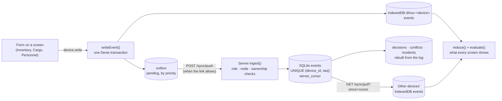

# How DHRUV stores data

This page answers the evaluator question "how is the data actually stored?". In the app, the **Where data lives** screen (`/data`) shows the same thing live for the device you are signed in on.

## The short version

- **One kind of record: the event.** Every change (a stock issue, a leg delay, a person moved, a decision approved) is one immutable event. Nothing is ever edited in place. A correction is a new event.
- **Written on the device first.** The browser stores the event in its own IndexedDB database and queues it in an outbox, in one transaction. This works with no network.
- **Appended on the server when the link allows.** The server keeps an append-only `events` table in SQLite. It is the source of truth.
- **Everything you see is computed.** Stock levels, readiness ratios, decisions, conflicts and incidents are derived from the events each time. They are never typed in as numbers.



## The event envelope

Every event carries the same fields (`packages/shared/src/events.ts`, `opEventSchema`):

| Field | Meaning |
|---|---|
| `event_id` | UUID, globally unique |
| `device_id`, `seq` | Which device wrote it and its per-device sequence number. `(device_id, seq)` is the idempotency key |
| `type`, `payload` | What happened, with a payload validated by a zod schema per type |
| `entity_type`, `entity_id`, `node_id` | What it is about, and which station it belongs to |
| `observed_at` | When it happened (demo time). Events are reduced in `(observed_at, device_id, seq)` order |
| `created_at_client` | When the device wrote it (device clock) |
| `recorded_at_server` | When the server accepted it. Empty until then |
| `priority` | Sync tier P0 (incident) … P5 (attachments). The outbox drains P0 first |
| `actor_role`, `schema_version` | Who wrote it, and the envelope version |

## On the device: IndexedDB (Dexie)

One database per device, named `dhruv-<device_id>` (`packages/store/src/db.ts`):

| Store | Key | Holds |
|---|---|---|
| `events` | `event_id` | Every event this device knows: its own and the ones it pulled |
| `outbox` | `[device_id+seq]` | Its own events not yet accepted by the server: `pending`, or `rejected` with the server's reason |
| `meta` | `key` | `seq` (last sequence number), `cursor` (how far it has pulled), `epoch` (which run of the server log), `sync_failures` |
| `cache` | `key` | The season's reference data (`seed`), so the app starts offline |

`writeEvent()` (`packages/store/src/write.ts`) is the only write path. It checks the role and the payload, assigns the next `seq`, and writes to `events` and `outbox` in a single transaction. Demo controls (`CLOCK_ADVANCED`, `LINK_STATE_SET`) are stored as local-only events and never enter the outbox.

## On the server: SQLite

`apps/server/src/db/schema.ts`, WAL journal, foreign keys on. The file is `dhruv.db` (or `DHRUV_DB_FILE`).

| Table | Role |
|---|---|
| `events` | **Source of truth.** Append-only. `UNIQUE (device_id, seq)`. `server_cursor` is assigned on insert and drives pulls. Indexed by entity, cursor and type |
| `decisions`, `conflicts`, `incidents` | **Projections.** Wiped and rebuilt from the whole log after each accepted batch (`db/projections.ts`) |
| `nodes`, `vessels`, `shipments`, `legs`, `inventory_items`, `consumption_profiles`, `cargo_items`, `personnel`, `assets`, `missions`, `levers`, `dependencies`, `link_state` | **Reference data** for the season (the seed). Read-only while the season runs; loaded by `pnpm seed` or Reset to Start |
| `server_meta` | The log `epoch`, renewed on every Reset to Start |

`GET /api/v1/storage` returns row counts for all of these (never rows).

## Sync

- **Push** (`POST /sync/push`): a device sends its pending outbox in priority order. Each event gets its own answer: accepted, duplicate or rejected. A resend of the same `(device_id, seq, event_id)` is a no-op. The same `(device_id, seq)` with a different `event_id` is `DUPLICATE_SEQ_CONFLICT`.
- **Pull** (`GET /sync/pull?since=<cursor>`): a device fetches other devices' events after its cursor. The cursor is stored in `meta` only after the batch is saved, so a pull cut off halfway simply repeats.
- **Link.** Online sends everything, Degraded sends up to 2.5 KB per demo second and holds P5, Offline sends nothing. The outbox keeps growing and nothing is lost.
- **Epoch.** Reset to Start renews the server's epoch. A device that loaded an older epoch clears its store and reloads, so two runs of the demo never mix.

## Computed, not stored

The seed row for Maitri diesel says 92.0 kL and is never updated. The number on every screen is:

```
stock = last STOCK_COUNTED (or the seed figure if none)
      + STOCK_RECEIVED after it
      − STOCK_ISSUED after it          (merge class B, packages/shared/src/stock.ts)
```

The same applies everywhere:

- a leg's ETA is the last `LEG_UPDATED` / `LEG_DELAYED` (merge class C);
- a person's status is the most conservative recent report (class CS);
- created shipments are folded into the seed's shipments (`withCreatedShipments`);
- readiness is `evaluate()` over all of it.

Two devices holding the same events always compute the same numbers. That is what makes offline work safe to merge.

## Merge classes

| Class | Rule | Examples |
|---|---|---|
| A | Immutable: recorded once | `INCIDENT_OPENED`, `PERSON_MOVED`, `SHIPMENT_CREATED`, decisions |
| B | Quantity: last count plus deltas, in reduce order. A negative result is flagged | `STOCK_*` |
| C | Last write wins by `observed_at` | `LEG_UPDATED`, `VESSEL_UPDATED`, `MISSION_UPDATED` |
| CS | Safety-critical: the most conservative value wins and a `CONFLICT_FLAGGED` goes to review | `PERSON_STATUS_SET`, `ASSET_STATUS_SET`, `INCIDENT_UPDATED` |
