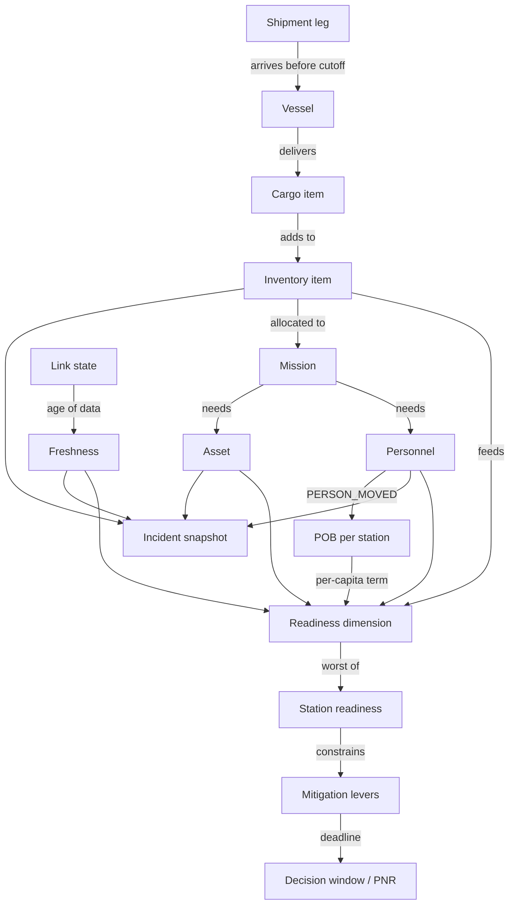

# DHRUV / Paridhi — Combined Technical Specification
SIH 2026 · PS 26062 · Integrated Polar Expedition Logistics and Asset Management System (MoES / NCPOR)

**Status: this file is the single source of truth. It replaces both the earlier "Build Bible" and "Paridhi v2" documents — nothing in this repo or in any prompt should reference either of those by name again; everything either document said that still applies has been folded in here.**

All data referenced anywhere in this file (stock levels, personnel, costs, dates) is **SYNTHETIC** unless explicitly marked otherwise. None of it is real NCPOR data.

Team: 3 prototype builders (A = engine/seed, B = frontend, C = backend/sync/map), plus one team member handling PPT and demo video separately, outside this document's scope.

---

## 1. Product identity

**One-line definition.** Paridhi is a deterministic, offline-capable decision layer that sits on top of whatever system of record NCPOR uses. Every change is an event; one pure TypeScript engine turns the event log into station readiness, per-lever decision deadlines, and freshness-adjusted confidence — and every number opens to its arithmetic.

**Non-technical definition.** It tells polar logistics teams what a delay will break, by when they must act, and how far to trust the data.

**Category.** Operational decision-support system — not an ERP, not a dashboard, not a digital twin.

**Core loop (locked).**
```
EVENT → PROPAGATE → EVALUATE (with freshness) → OPTIONS → HUMAN DECISION → COMMITTED AS EVENT → RECOMPUTE
```

**Three differentiators, final wording.**
1. **Show-the-math trace.** Cross-module propagation itself is established elsewhere (Kinaxis, Palantir already do it centrally). Our claim is narrower: it runs on a disconnected station node, over inputs whose age is shown, and every output opens to an inspectable trace in one click.
2. **Per-lever decision deadlines / point of no return.** Window-backward scheduling is established practice (USAP); "survive a missed resupply" is established in space logistics (ISS skip cycles). Our claim: an automated, per-lever decision deadline computed from live stock and lead times, recomputed on every event.
3. **Freshness that changes the computed answer.** Showing a last-updated timestamp is established (OpenLMIS). Our claim: data age widens the computed ratio band, can flip a Green into "could be Amber," and forces a verify step before an option can be approved.

**Claims discipline — say this, not more.**
- We can say: existing systems publicly document cargo, asset and inventory transactions (BAS and USAP both run Maximo; AAD uses eCon). NCPOR itself specified a centrally hosted inventory tool in 2015 (tender AES-11298); whether it was built and deployed is not public. Propagation and what-if exist centrally (Kinaxis, Palantir). Survival planning for a missed resupply exists in space logistics (ISS).
- We can say, verbatim: *"We found no public evidence of a system that, for a national polar programme, runs consequence reasoning locally on a disconnected station, ties it to a discrete closing resupply window with automated per-lever decision deadlines, and changes its answer with the age of its inputs."*
- We can say: on the same event, a stock-level alert shows nothing while Paridhi shows RED with a 10-day deadline (synthetic data) — this is the B0 baseline, section 26.
- We must never say: "first", "only", "no such system exists", "novel CRDT", "AI-powered" as a headline, "digital twin", "blockchain", "real-time satellite", "validated on NCPOR data", "predicts the day of shortage" (we show a reserve-breach date at current burn rates, labelled as arithmetic, not a prediction), "replaces SAR/distress systems", and anything about "skip-cycle margin" (that concept was replaced by slip tolerance, section 7, R16).

---

## 2. Locked decisions and things we will not build

| # | Decision |
| --- | --- |
| 1 | Category: operational decision-support system |
| 2 | Three differentiators as stated in section 1 |
| 3 | Demo geography: Goa HQ, Mumbai, Cape Town, vessel, Maitri (hero station), Bharati (contrast station). Himadri/Arctic is roadmap only |
| 4 | Frontend: React 18 + TypeScript + Vite + Tailwind, installable PWA |
| 5 | Local storage: Dexie (IndexedDB) |
| 6 | Backend: Node.js + Fastify + SQLite (better-sqlite3) |
| 7 | Engine: one pure TypeScript package (`packages/engine`), zero runtime dependencies except `@dhruv/shared`. No ML |
| 8 | State model: append-only event log; all state is a projection of events (`reduce()`) |
| 9 | Sync: idempotent events keyed `(device_id, seq)`; commutative deltas for stock; last-write-wins for ordinary fields; conservative-value-kept + human review for safety-critical fields. No full CRDT library, no escrow (roadmap only) |
| 10 | Readiness rule: station state = worst of its dimensions (never a weighted average) |
| 11 | Thresholds: Green ≥1.05, Amber 0.95–<1.05, Red <0.95 on available/required. SYNTHETIC, editable in one config file |
| 12 | Nothing changes operational state without a human-approved `DECISION_APPROVED` event |
| 13 | AI: explain a trace and draft a brief, from the trace only, template fallback. Never computes or decides |
| 14 | Roles: HQ Ops, Station Leader, Field Lead. Emergency is a mode, not a role |
| 15 | The what-if simulator runs the exact same engine as the live view, via a hypothetical event overlay — never a separate calculator |
| 16 | Time comes from an injectable clock everywhere; the demo has a visible clock with `+1h / +6h / +30h` (superseded to absolute jumps, section 20) |
| 17 | Data: fully synthetic; persistent banner: "Synthetic demonstration data. Not operational NCPOR data." |
| 18 | Maps: Leaflet with real public coordinates for stations/cities; schematic fallback |
| 19 | Feature freeze: end of Day 8 of the active build cycle |
| 20 | Wording: "no public evidence found", never "no such system exists" |
| 21 | pnpm workspace (not npm/yarn) — required so `packages/engine` can be imported identically by both `apps/web` and `apps/server` via `workspace:*` |
| 22 | Package manager and Node version pinned at the workspace root only; individual packages do not each declare their own `typescript` version |

**Never build:** blockchain, full digital twin/3D, real IoT/sensor hardware, trained ML forecasting, full CRDT library or escrow pools, ERP features (procurement/finance/HR), biometric systems, autonomous AI decisions, chat/social features, live integrations with real NCPOR/GeM/eOffice/satellite systems, extra roles, multi-tenant/SSO, a settings page, Monte Carlo simulation, Bayesian demand regression, hybrid logical clocks / bitemporal queries, an eight-experiment ablation research program.

---

## 3. Core loop, roles, permissions

An event enters through a form, a sync, a simulator overlay, or a seed. The engine recomputes the whole station evaluation from the event log (target: under 50ms for the demo dataset). The UI never stores computed values — it always renders the latest `evaluate()` output. A human decision is itself an event, so the audit log and the state can never diverge.

**Roles (locked, three).**

| Role | Node | Sees | Can change | Decides | Works offline |
| --- | --- | --- | --- | --- | --- |
| HQ Ops (Goa) | HQ | All stations, shipments, decisions | Shipments/legs, plans, missions, personnel assignments; approves decisions | Approves/rejects mitigation options; enters emergency mode | Read cache only |
| Station Leader | Maitri or Bharati | Own station in full; other stations read-only summary | Stock counts/issues, personnel status, asset status, incidents; approves station-level decisions | Confirms stock reality, approves local mitigation, escalates incident | Yes, full |
| Field Lead | Mobile PWA | Own team, mission, last-known positions | Check-ins, position, own status, raise incident | Go/no-go for own team | Yes, full |

Emergency mode is a UI mode reachable by HQ Ops or Station Leader after an incident is opened — not a fourth role.

**Permission rules (enforced server-side, mirrored in UI):** a Field Lead cannot approve decisions or edit shipments; a Station Leader can only write events with `node_id` equal to their own station; only HQ Ops approves decisions touching shipments, vessels, or cross-station allocation; every write requires `actor_role` and `device_id`; the server rejects events whose role does not permit their type (section 6).

---

## 4. Domain model and dependency graph



**Entities (locked).**

| Entity | Purpose | Key fields | Edges out |
| --- | --- | --- | --- |
| Expedition | The season | id, name, phase calendar | has stations, vessels |
| Node | Goa, Mumbai, Cape Town, vessel, Maitri, Bharati | id, type, lat, lon | hosts personnel, assets, inventory |
| Vessel | The resupply ship | id, departure, load_cutoff, eta_station, station_closing_date | carries shipments |
| Shipment | A container journey | id, name, priority | has legs, cargo items |
| Leg | One movement step | id, shipment_id, seq, from_node, to_node, etd, eta, vessel_id?, status | leg may be on a vessel |
| CargoItem | What is inside | id, shipment_id, inventory_item_id, qty, unit | adds to inventory item |
| InventoryItem | Station stock line | id, node_id, category, unit, stock, reserve_pct, requirement_mode, dimension, last_counted, count_source | consumed by profile, needed by missions |
| ConsumptionProfile | Burn rate by phase | item_id, phase, rate_per_day | used by engine |
| Personnel | A person | id, name, role, node_id, status, last_seen | assigned to missions, moved by PERSON_MOVED |
| Movement | Person travel step | id, person_id, from, to, depart, arrive | changes location |
| Asset | Vehicle, generator, comms unit | id, node_id, type, status, lat, lon, last_seen, speed_kmh | needed by missions |
| Mission | Field or station task | id, node_id, start, end, fuel_kl, needs (people[], assets[]), status | uses inventory, personnel, assets |
| Incident | An emergency | id, type, person_id, opened_at, status, last_confirmed_at | snapshot of state |
| Decision | A human choice | id, trigger_event_id, options, trace, chosen_option_id, approver, verify_ack | emits follow-up events |
| Event | The source of truth | see section 6 | drives everything |
| LinkState | Comms per node | node_id, status, last_contact | feeds freshness |

**Data ownership rules:** every fact has an `observed_at` (when it was true in the world) and, for server-received events, a `recorded_at_server` (when the server learned it). Freshness always uses `observed_at`. Computed values (ratios, states, windows, freshness, bands) are never stored — always recomputed from events plus the current clock.

---

## 5. Event model

Every change is an event. State is `reduce(events, seed)`. Events are never edited or deleted; corrections are new events.

**Envelope (locked).**
```ts
interface OpEvent {
  event_id: string;            // uuid v4, client-generated
  device_id: string;           // e.g. "MAITRI-TAB-01"
  seq: number;                 // per-device monotonic counter, starts at 1
  type: EventType;
  entity_type: string;         // "inventory_item" | "leg" | "person" | ...
  entity_id: string;
  node_id: string;              // node where this happened
  payload: Record<string, unknown>;
  observed_at: string;          // ISO 8601, when the fact was true in the world
  created_at_client: string;    // ISO, device clock (untrusted for ordering)
  recorded_at_server?: string;  // ISO, set on first server receipt
  priority: 0 | 1 | 2 | 3 | 4 | 5;
  actor_role: "HQ_OPS" | "STATION_LEADER" | "FIELD_LEAD" | "SYSTEM";
  schema_version: 1;
}
```

Idempotency: `(device_id, seq)` is unique — re-sending an event is always safe. Ordering for reductions uses `(observed_at, device_id, seq)`; the server clock is only used for sync bookkeeping, since offline device clocks drift.

**Priority tiers (locked).**

| P | Class | Examples |
| --- | --- | --- |
| 0 | Incident / SOS | INCIDENT_OPENED, INCIDENT_UPDATED |
| 1 | Personnel and medical status | PERSON_STATUS_SET, CHECKIN_RECORDED, PERSON_MOVED |
| 2 | Fuel and critical stock | STOCK_ISSUED, STOCK_RECEIVED, STOCK_COUNTED (fuel, medical, spares) |
| 3 | Cargo | SHIPMENT_CREATED, LEG_DELAYED, LEG_UPDATED, CARGO_STATUS_SET |
| 4 | Routine | Task notes, mission edits, non-critical stock |
| 5 | Attachments | Photos, reports (chunked, resumable) |

**Event types (locked).**

| Type | Payload | Allowed roles |
| --- | --- | --- |
| STOCK_COUNTED | item_id, qty | Station Leader, HQ |
| STOCK_ISSUED | item_id, qty (positive), reason, mission_id? | Station Leader |
| STOCK_RECEIVED | item_id, qty, shipment_id? | Station Leader |
| BURN_RATE_CHANGED | item_id, phase, new_rate or uplift_pct | Station Leader, HQ |
| **SHIPMENT_CREATED** | shipment_id, name, priority, dest_node_id, legs[] (leg_id, seq, from_node, to_node, etd?, eta, vessel_id?), cargo[] (inventory_item_id, qty) | HQ |
| LEG_UPDATED | leg_id, etd?, eta?, status | HQ |
| LEG_DELAYED | leg_id, new_eta, reason | HQ |
| VESSEL_UPDATED | vessel_id, departure?, load_cutoff?, eta_station? | HQ |
| PERSON_STATUS_SET | person_id, status (ON_STATION, FIELD, UNAVAILABLE, INJURED, EVACUATED) | Station Leader, Field Lead (self), HQ |
| **PERSON_MOVED** | person_id, from_node, to_node, depart, arrive | HQ, Station Leader |
| CHECKIN_RECORDED | person_or_team_id, lat, lon, note | Field Lead, Station Leader |
| ASSET_STATUS_SET | asset_id, status (OK, DEGRADED, DOWN), lat?, lon? | Station Leader, HQ |
| MISSION_UPDATED | mission_id, fields | HQ, Station Leader |
| ASSIGNMENT_SET | person_id, mission_id/task, start, end | HQ, Station Leader |
| LINK_STATE_SET | node_id, status (ONLINE, DEGRADED, OFFLINE) | SYSTEM |
| INCIDENT_OPENED | incident_id, type, person_ids, last_confirmed_at, note | Station Leader, HQ, Field Lead |
| INCIDENT_UPDATED | incident_id, status, note | Station Leader, HQ |
| DECISION_PROPOSED | decision_id, trigger_event_id, options[], trace | SYSTEM |
| DECISION_APPROVED | decision_id, chosen_option_id, approver, verify_ack | HQ (or Station Leader for station-level) |
| DECISION_REJECTED | decision_id, reason | HQ |
| CONFLICT_FLAGGED | entity_id, field, contenders[], conservative_value | SYSTEM |
| CONFLICT_RESOLVED | conflict_id, chosen_value, resolver | HQ, Station Leader |
| CLOCK_ADVANCED | absolute target time (see section 9) | DEMO only |

**SHIPMENT_CREATED** is a DHRUV addition to the locked list (data management, Sep 2026): no event could create a shipment, so shipments existed only in the seed. It is merge class A (a shipment is created once), priority 3, HQ only. The server refuses a shipment or leg id that already exists, a destination that is not a station, and a cargo line for an item the destination does not hold. `withCreatedShipments(seed, events)` (packages/shared) folds these events into the seed's shipments, legs and cargo lines in reduce order, so the engine counts the cargo as inbound (R02) and LEG_UPDATED / LEG_DELAYED work on its legs like any seeded one.

**Reducer contract.** `reduce(seed: Seed, events: OpEvent[]): State` is pure. (This corrects an earlier version of this doc, which had the wrong argument order and mislabeled the seed parameter's type.) Two devices holding the same set of events, in any arrival order, must produce identical state (test T-SYNC-01).

**Merge rules by field kind.**

| Field kind | Merge rule |
| --- | --- |
| Stock quantity | Sum of signed deltas since the last STOCK_COUNTED (commutative). A later STOCK_COUNTED resets the base |
| Ordinary fields (ETA, note, mission dates) | Last write wins by `(observed_at, device_id, seq)` |
| Safety-critical fields (asset status, person status INJURED/UNAVAILABLE, incident status) | Keep the more conservative value (DOWN over OK, INJURED over ON_STATION), emit CONFLICT_FLAGGED, wait for human CONFLICT_RESOLVED |
| Domain violations (negative stock, person double-assigned) | Accept both events, emit CONFLICT_FLAGGED, block downstream decisions depending on that entity until resolved |

---

## 6. Sync merge classes (named)

| Class | Applies to | Rule |
| --- | --- | --- |
| A. Immutable facts | Check-ins, cargo status, counts | Union of events, no conflict possible |
| B. Invariant quantities | Stock | Commutative sum of deltas since last count; negative result → Review queue |
| B*. Shared allocatable pools | Seats, cargo space | **Not built.** Roadmap only (section 27) |
| C. Owner-authoritative | ETA, notes, mission dates | Last write wins by `(observed_at, device_id, seq)` |
| C-S. Safety-critical | Asset status, person INJURED/UNAVAILABLE, incident status | Keep the more conservative value, always flagged to a human, never auto-resolved |

Convergence property (T-SYNC-01): any two replicas holding the same event set produce deep-equal state regardless of arrival order.

**Sync protocol.**
1. `POST /sync/push` with a batch of outbox events, ordered by priority then seq, within the current byte budget. Server inserts each with an idempotent `(device_id, seq)` key and returns accepted / duplicate / rejected lists.
2. Client removes acknowledged events from its outbox.
3. `GET /sync/pull?since=<cursor>` returns events from other devices; client inserts (ignoring duplicates) and re-runs the engine.
4. Retry with exponential backoff (2, 4, 8, 16, 30s cap); mark `stalled` after 5 failed attempts.

**Priority drain and byte budget.**

| Link state (simulated) | Budget per cycle | Behaviour |
| --- | --- | --- |
| ONLINE | unlimited | Drain everything |
| DEGRADED (20 kbps) | 2.5 KB/sec of demo time | Drain in priority order; P5 waits |
| OFFLINE | 0 | Nothing leaves; queue grows; pending count and oldest-pending age shown |

---

## 7. Engine spec — rules and formulas

The engine is one pure TypeScript package: `evaluate(state, now, overlay?) -> Evaluation`. No I/O, no randomness, no ML, no `Date.now()`. Runs identically in the browser (offline, at a station) and on the server (sync-time check). The same function serves the live view, the what-if simulator, and the emergency snapshot.

### Core formulas

```
R_base = Σ over phases from today to next resupply of (days_in_phase × rate_per_day)
R = (R_base − S) × (1 + u) × (1 + r)          # S = lever savings, u = burn uplift, r = reserve fraction
A = stock + Σ inbound_feasible
ratio = A / R
state = GREEN if ratio ≥ 1.05; AMBER if 0.95 ≤ ratio < 1.05; RED otherwise
gap = max(0, R − A)
deadline_L = cutoff_L − lead_L                 # per mitigation lever L
PNR = max over options that reach target of ( min over levers in that option of deadline_L )
```

`inbound_feasible` counts a cargo item only if its shipment leg reaches the vessel before the vessel's load cutoff, AND the vessel reaches the station on or before the station closing date. A leg that fails this is a **window cliff** — it does not slip a few days, it slips to the next window entirely.

**Slip tolerance (R16 — replaces the old "skip-cycle margin" concept entirely; do not use that term anywhere).**
```
E = A − R_base × (1 + u) − reserve
if E ≥ 0: slipToleranceDays = floor( E / rate_post )     # rate_post = configured post-window burn rate
if E < 0: reserveBreachDate = first date at which (A − cumulative burn from today) = reserve
          daysShortOfWindow = nextResupplyDate − reserveBreachDate
```
This answers "how late can the next ship be before reserve is touched" — the question that actually matters for a once-a-year station, replacing the old "what if the window is missed entirely" framing (which always produced an uninformative large deficit).

**Baseline B0 (R18) — computed alongside the engine, never feeds into state.** What a plain stock-level alert would show: alert if on-hand stock is below a fixed threshold, or if days-of-cover at today's burn rate drops below a limit. Exposed in the trace drawer as a single greyed line for direct comparison. On the frozen dataset: after C-104 slips, on-hand diesel is unchanged at 92.0 kL, so B0 shows **no alert**, while the engine shows RED with a 10-day PNR — this contrast is the single strongest piece of evidence the product has.

**POB-driven food requirement (R19, P1 — cut first if behind schedule).** Food's `R_base` uses live personnel-on-board count (from PERSON_MOVED and PERSON_STATUS_SET events), not a fixed headcount: `R_base = POB × per_person_rate × days_to_resupply`.

### Rule table (locked IDs, used in trace text and tests)

| ID | Rule | Output |
| --- | --- | --- |
| R01 | Requirement to next resupply per item from phase profile | R_base |
| R02 | Inbound feasibility: leg ETA vs vessel load cutoff, vessel ETA vs closing date ("window cliff") | feasible cargo list, reason if excluded, **slackDays per inbound** |
| R03 | Availability A, ratio, state per item | ratio, state |
| R04 | Dimension state = worst state of its items | dimension state |
| R05 | Personnel role coverage: ≥need+1 Green, =need Amber, <need Red | personnel state |
| R06 | Generator/comms redundancy, same pattern as R05 | power/comms state |
| R07 | Mission impact: fuel-drawing mission with Red fuel is AT_RISK; missing person/asset is BLOCKED | mission statuses |
| R08 | Lever catalogue: which levers exist for the gap and their deadlines | lever list |
| R09 | Option generation: subsets of up to 3 levers, re-evaluate ratio for each; **each option carries `slackDays` = min slack of the inbound(s) it relies on** | option list |
| R10 | Option ranking and selection of up to 3 to show; slack displayed on every option | ranked options |
| R11 | Point of no return: latest deadline among options that reach the target state | PNR date, days left |
| R12 | Freshness class per input | freshness map |
| R13 | Confidence band — **asymmetric** (section 8) | band, straddle flag |
| R14 | Verify-first: any option depending on STALE/CRITICAL input, or an UNCERTAIN inbound (R17), requires ticked verification | flags |
| R15 | Station state = worst dimension; open incident or unresolved safety conflict adds a gate banner | station state |
| R16 | **Slip tolerance** (replaces skip-cycle margin) | slipToleranceDays or reserveBreachDate + daysShortOfWindow |
| R17 | **Cargo feasibility confidence** — if an inbound leg's ETA report is STALE+ and its slack to cutoff is ≤2 days, mark the inbound UNCERTAIN; band's low side computed without it | UNCERTAIN flag per inbound |
| R18 | **Baseline B0** — comparison only, never drives state | B0 alert value |
| R19 | **POB-driven food requirement** (P1) | food R_base from live POB |

### Dimension map

| Dimension | Items evaluated |
| --- | --- |
| Fuel | Diesel (kL) |
| Food | Food (person-days), POB-driven via R19 |
| Medical | Winter medical kits, oxygen cylinders |
| Spares and power | Genset overhaul kits; generator redundancy |
| Personnel | Roles: doctor, diesel mechanic, comms engineer, cook |
| Comms | VSAT and Iridium units |

### Worked example (the frozen dataset, section 13) — this is what the golden tests assert

| Step | Value |
| --- | --- |
| Today | 24 Jan 2027 (fictional calendar) |
| R_base (diesel) | 120.0 kL; with 10% reserve, R = 132.0 kL |
| On-site stock | 92.0 kL |
| Start / after HOLD_VESSEL approved | A = 140.0, ratio 1.0606, **GREEN**; slip tolerance **22 days** |
| Event: C-104 delayed to 7 Feb | 7 Feb is after the 4 Feb vessel load cutoff → inbound excluded. A = 92.0, ratio **0.697**, **RED**, gap 40.0 kL |
| Reserve breach after the slip | **6 Aug 2027**, 106 days short of the 20 Nov window |
| Levers | HOLD_VESSEL deadline 3 Feb (adds 48.0 kL, depart 9 Feb); AIRLIFT_PARTIAL deadline 31 Jan (adds 12.0 kL); DEFER_F27 deadline 2 Feb (saves 4.0 kL raw); CONSERVE deadline 27 Feb (saves 8.0 kL raw) |
| Option (a) `{HOLD_VESSEL}` | 140.0 / 132.0 = **1.0606 GREEN**, cost 19.5 lakh (SYNTHETIC), deadline 3 Feb, slack 0 days |
| Option (b) `{HOLD_VESSEL, CONSERVE, DEFER_F27}` | 140.0 / 118.8 = **1.1785 GREEN**, deadline 2 Feb (DEFER_F27 is the binding lever), slack 0 days |
| Option (c) `{AIRLIFT_PARTIAL, DEFER_F27, CONSERVE}` | 104.0 / 118.8 = **0.8754 RED**, residual gap 14.8 kL, deadline 31 Jan, no inbound dependency |
| **Point of no return** | **3 Feb 2027, 10 days left** |
| After HOLD approved, burn +15% (what-if) | R = 151.8; 140.0 / 151.8 = **0.9223 RED**; reserve breach 23 Oct 2027, 28 days short |
| Same, plus CONSERVE + DEFER_F27 | R = 136.62; 140.0 / 136.62 = **1.0247 AMBER** |
| Bharati diesel (contrast station) | Stock 135.0, R = 118.8, ratio **1.1364 GREEN**; slip tolerance **40 days** |
| Freshness example (HQ view, 25 Jan 16:00, count observed 24 Jan 04:00) | Age 36h, AGING, u=3%; band low **1.0334**, high 1.0815 → **straddles = true**; text: "GREEN, could be AMBER" |
| Freshness example (after sync, count 7h old) | FRESH; band low **1.0524** → clean GREEN, no straddle |
| Cargo feasibility confidence example (R17) | Clock 26 Jan 09:00, C-104 ETA report 48h50min old, slack 0 days → inbound marked **UNCERTAIN**; point 1.0606, low **0.6970** → "GREEN, could be RED"; verify-first set |

### Explainability rule

Every colour, number, and date visible on the Command Center must have a `trace` reachable in one click. If a number cannot be traced to a rule, it does not go on screen. Trace text format: `[R03] Diesel availability vs requirement: 92.0 / 132.0 = 0.697 -> RED`.

---

## 8. Freshness spec

Every input carries `observed_at`. Freshness is `now − observed_at` **as seen by the viewing node** — a station sees its own data as fresh immediately; HQ sees the same data as aging until sync completes.

**Classes and thresholds (SYNTHETIC, in `packages/shared/src/config.ts`).**

| Source | FRESH | AGING | STALE | CRITICAL | Effect on numbers |
| --- | --- | --- | --- | --- | --- |
| Fuel / critical stock count | <24h | <72h | <7d | ≥7d | Asymmetric band, u = 1/3/6/12% |
| Cargo leg ETA | <12h | <48h | <7d | ≥7d | R17: UNCERTAIN inbound if STALE+ and slack ≤2 days |
| Person / vehicle position | <1h | <6h | <24h | ≥24h | Circle radius = min(age_h × 3 km/h, 30 km) |
| Link contact | <1h | <6h | <24h | ≥24h | Comms banner |
| Asset status | <6h | <24h | <72h | ≥72h | Verify-first if used by a mission |

**Asymmetric band (R13, corrected from an earlier symmetric version — stock only ever depletes while unobserved, so uncertainty is one-sided).**
```
b = expected burn since the count = rate_now × age_days
low  = ( stock × (1 − u_f) − b + inbound ) / R
high = ( stock × (1 + u_f) + inbound ) / R
```
Straddle flag fires when `low` falls into a worse state than the point estimate.

**What freshness changes:**
1. Output freshness = oldest critical input's freshness class.
2. Confidence band widens per the formula above; a straddling band shows "GREEN, could be AMBER" (or worse) directly on the card.
3. **Verify-first (R14):** any option depending on a STALE/CRITICAL input, or an UNCERTAIN inbound (R17), shows "Verify before acting" and requires a ticked confirmation, recorded in `DECISION_APPROVED.verify_ack`.
4. Position uncertainty: a growing circle on the map, radius per the formula above.
5. Nothing is ever hidden — unknown values render as `unknown`, never as zero.

**Visual language:** FRESH = normal text, green dot. AGING = amber dot. STALE = amber striped background, italic value. CRITICAL = red striped background, greyed value, "verify" chip.

**Demo clock.** A demo-mode control jumps to **absolute** times (not relative "+N hours" — that produced ambiguous "now"s across a moving clock). Buttons: "Jump to 25 Jan 16:00" etc., driven by the Director panel (section 20). `clock.now()` is the only time source anywhere in the app; the engine never calls `Date.now()`.

---

## 9. Offline architecture

**What works offline:** view cached state and its age; create any event the role allows; run the full engine locally on local events; record station-level decisions; open/update an incident; see pending queue count and per-item state.

**What does not:** seeing other nodes' new events until sync; HQ-authority decision approval (queued as a proposal); uncached map tiles (schematic fallback); attachment upload (queued, lowest priority); AI explanation (falls back to templates).

**Client architecture.** Dexie database `paridhi` with stores: `events` (all known events, PK `event_id`), `outbox` (unacknowledged events, key `[device_id+seq]`), `meta` (last pulled cursor, device id, seq counter), `cache` (map tile metadata). The UI reads only from the local `events` store and the engine — never waits on the network.

---

## 10. Emergency and incident spec

Emergency response is a cross-cutting layer reading the shared state, not a separate app. Real distress communication and rescue infrastructure remain authoritative; Paridhi assembles operational context and always requires human verification before action.

**Lifecycle:** Opened → Snapshot (engine-built) → Verifying (human confirms reality) → Escalated or Resolved → Reported.

**Triggers:** manual (any role can open); automatic proposal when a check-in is overdue by more than the grace period (SYNTHETIC: 3 hours) — a human still opens it.

**Snapshot contents:** affected people and roles (with status age), last confirmed position and time (with uncertainty circle), nearby people/vehicles (each position's age), nearest capable assets with rough ETA, medical resources (with count age), fuel available for a response, comms state, last 10 relevant events, any open conflicts touching involved entities.

**Response-option autonomy cost (built into the Incident screen, computed by the same `evaluate()` call the what-if drawer uses — no separate calculation).** Under each candidate responder, one line: e.g. *"Sending SK-1 for 4 hours: diesel skip-cycle margin drops from +4.2 to +3.1 kL, station stays GREEN."* **Correction:** aviation fuel (used by HX-1, the helicopter) is **not tracked separately** in this dataset — do not claim it is. A vehicle drawing from the same diesel pool as station power is the correct example to use for this feature; the helicopter line should say the diesel pool is unaffected, honestly, rather than imply a separate tracked reserve that doesn't exist.

**Frozen scenario.** Field team FT-3 (Dr A. Verma, glaciologist; R. Nair, field guide) on mission F-27 support, skidoo SK-4. Check-ins due every 4 hours; last recorded 07:00, 25 Jan, at −70.62, 12.10 (SYNTHETIC, ~21 km from Maitri). Next check-in due 11:00; with the 3-hour grace it is overdue at 14:00 and the system proposes an incident; Station Leader opens it at 16:00, when the last confirmed position is 9 hours old — circle radius 27 km. Nearest capable asset: helicopter HX-1 (station helipad), ETA ~11 min at 120 km/h; skidoo SK-2 is flagged with an unresolved conflict (DOWN kept per the conservative-merge rule) and excluded as a candidate until a human resolves it.

---

## 11. What-if simulator spec

Not a separate calculator — a fork of current state plus hypothetical events, run through the exact same `evaluate()`. Overlay events are tagged `overlay: true` and never written to the event log.

**Scenario types (locked, six):** leg/vessel delay (days slider); burn rate change (± percent); asset unavailable; person unavailable; comms lost for N hours; resupply window missed entirely (toggle).

**Output panel:** changed assumption, before/after readiness per dimension, new decision windows and PNR with the delta, missions affected, options that still work vs. expired, a "Show the math" toggle for the new result.

**Guardrails:** overlay results carry a `SIMULATION` striped banner; the simulator has no free-text input, only the six fixed scenario types.

---

## 12. AI layer spec

Tier 2 — cut first if the team is behind schedule. The product must be complete and convincing without it.

**Two buttons only:** "Explain this alert" and "Draft decision brief." No free-form chat.

**Prompt contract:** input is the structured `trace` JSON, the chosen option JSON, and the reader's role — nothing else. Output stays under 120 words, uses only numbers/dates/names present in the input, says "not available" rather than guessing.

**Hallucination controls:** after generation, extract every number/date from the output text; if any is not present in the input trace, reject and show the template instead. No key, timeout >6s, or a failed check → template fallback (same layout either way). Offline → AI button disabled, template runs locally.

**Label on every AI output:** "Explanation drafted by AI from the engine's trace. The engine is the source of truth."

---

## 13. Synthetic dataset (frozen — "Season 48 demo")

**Calendar.** Demo start 24 Jan 2027, 08:00. CLOSING phase 24 Jan–1 Mar (36 days). WINTER phase 1 Mar–16 Nov (260 days). MOBILISATION phase 16 Nov–20 Nov (4 days). Next resupply horizon: 20 Nov 2027. Vessel MV Ice Star (fictional): Cape Town departure 6 Feb; load cutoff 4 Feb; Maitri ETA 24 Feb; station closing date 28 Feb.

**Real public coordinates used (context only, not operational data):** Goa HQ 15.40, 73.79; Mumbai port 18.95, 72.84; Cape Town −33.92, 18.42; Maitri −70.77, 11.73; Bharati −69.41, 76.19.

**Inventory (Maitri).**

| Item | Unit | Stock | Reserve | Requirement | R (with reserve) | Last counted |
| --- | --- | --- | --- | --- | --- | --- |
| Diesel | kL | 92.0 | 10% | Burn 0.55/0.38/0.35 (closing/winter/mobilisation) | 132.0 | 24 Jan 04:00 |
| Food | person-days | 8900 | 15% | 24 people × 300 days = 7200 | 8280 | 23 Jan 20:00 |
| Winter medical kits | kits | 10 | 50% | Fixed 6 | 9 | 22 Jan 10:00 |
| Oxygen cylinders | cylinders | 20 | 50% | Fixed 12 | 18 | 22 Jan 10:00 |
| Genset overhaul kits | kits | 4 | 50% | Fixed 2 | 3 | 20 Jan 10:00 |

**Inbound (Maitri).** C-104: diesel 48.0 kL, legs Goa→Mumbai (done), Mumbai→Cape Town (ETA 2 Feb, in transit), Cape Town→Maitri on MV Ice Star (ETD 6 Feb, ETA 24 Feb). C-107: medical kits ×2, genset kit ×1, ETA 30 Feb leg on time. C-112: science equipment, ETA 3 Feb, on time.

**Bharati (contrast station, stays GREEN throughout).** Diesel stock 135.0 kL; R_base = 108.0; R = 118.8; ratio 1.1364; slip tolerance 40 days.

**Personnel (Maitri, 24 winterers), assets, missions:** as previously fixed — Station Leader Cdr A. Rao, doctors K. Menon and P. Shah, logistics officer S. Kulkarni, glaciologist Dr A. Verma, field guide R. Nair, plus generated names for remaining roles (diesel mechanic ×2, electrician ×2, comms engineer ×2, cook ×2, atmospheric scientist ×3, technician ×4). Assets: GEN-1/2/3 (need 2 running), VSAT-1, IRD-1, SK-1..5, PB-1 (snow tractor), HX-1 (helicopter). Missions: F-27 (3–10 Feb, diesel 4.0 kL, Verma + Nair, SK-4 — the at-risk mission), F-31 (12–13 Feb, diesel 0.3 kL, unaffected).

**Levers (SYNTHETIC parameters, in config).**

| Lever | Effect | Cutoff | Lead | Deadline | Cost |
| --- | --- | --- | --- | --- | --- |
| HOLD_VESSEL | +48.0 kL feasible; departs 9 Feb | 6 Feb | 3 days | 3 Feb | 19.5 lakh |
| AIRLIFT_PARTIAL | +12.0 kL | 9 Feb | 9 days | 31 Jan | 48 lakh |
| DEFER_F27 | Saves 4.0 kL raw | 3 Feb | 1 day | 2 Feb | research impact |
| CONSERVE | Saves 8.0 kL raw | 1 Mar | 2 days | 27 Feb | comfort/ops impact |

**Other parameters:** check-in interval 4h, grace 3h; position drift speed 3 km/h, cap 30 km; link byte budget 2.5 KB/sec when Degraded.

**Scenario Director script (events injected at simulated times).**

| Beat | Sim time | Actor / device | Event |
| --- | --- | --- | --- |
| Start | 24 Jan 08:00 | seed | All GREEN, fuel count 4h old |
| 1. Slip | 24 Jan 08:10 | HQ Ops | LEG_DELAYED C-104 L2, new ETA 7 Feb |
| 2. Decision proposed | 24 Jan 08:11 | SYSTEM | DECISION_PROPOSED DEC-01, three options |
| 3. Link lost | 24 Jan 09:00 | SYSTEM | LINK_STATE_SET Maitri OFFLINE |
| **4. Offline entries + stock count** | 24 Jan 09:10–09:15 | Station Leader | STOCK_ISSUED medical kit ×1; ASSET_STATUS_SET SK-2 DOWN; **STOCK_COUNTED diesel 92.0 at Maitri, 09:15** (makes Maitri's own view FRESH while offline, and gives the demo a clean count to re-sync later) |
| 5. HQ-side edit | 24 Jan 11:00 | HQ Ops | ASSET_STATUS_SET SK-2 OK (stale maintenance plan) |
| 6. Jump to | **25 Jan 16:00** (absolute jump, Director beat 6 — not "+30h") | demo clock | HQ's fuel count is now 36h old, AGING |
| 7. Check-in | 25 Jan 07:00 | Field Lead | CHECKIN_RECORDED FT-3 at −70.62, 12.10 |
| 8. Incident | 25 Jan 16:00 | Station Leader | INCIDENT_OPENED INC-01 for FT-3 |
| 9. Link returns | 25 Jan 16:10 | SYSTEM | LINK_STATE_SET Maitri DEGRADED then ONLINE; drain in priority order |
| 10. Conflict | on sync | SYSTEM | CONFLICT_FLAGGED SK-2 (DOWN kept) |
| 11. Approval | 25 Jan 16:20 | HQ Ops | DECISION_APPROVED option (a), verify_ack ticked (at this point HQ's count is 7h old, FRESH, no straddle) |

**Seed files:** `packages/seed/src/season48.ts` exports typed arrays for nodes, vessel, shipments, legs, inventory, profiles, personnel, assets, missions, levers, and the Director events. `pnpm seed` resets local and server state to `Start`.

---

## 14. Database schema

Only `events` is the true source of truth. Every other table can be dropped and re-seeded or recomputed.

```sql
CREATE TABLE events (
  event_id TEXT PRIMARY KEY, device_id TEXT NOT NULL, seq INTEGER NOT NULL,
  type TEXT NOT NULL, entity_type TEXT NOT NULL, entity_id TEXT NOT NULL,
  node_id TEXT NOT NULL, payload TEXT NOT NULL, observed_at TEXT NOT NULL,
  created_at_client TEXT NOT NULL, recorded_at_server TEXT,
  priority INTEGER NOT NULL CHECK (priority BETWEEN 0 AND 5),
  actor_role TEXT NOT NULL, schema_version INTEGER NOT NULL DEFAULT 1,
  server_cursor INTEGER, UNIQUE (device_id, seq)
);
CREATE INDEX ix_events_entity ON events (entity_type, entity_id, observed_at);
CREATE INDEX ix_events_cursor ON events (server_cursor);
CREATE INDEX ix_events_type ON events (type, observed_at);

CREATE TABLE nodes (id TEXT PRIMARY KEY, name TEXT NOT NULL, type TEXT NOT NULL, lat REAL, lon REAL);
CREATE TABLE vessels (id TEXT PRIMARY KEY, name TEXT NOT NULL, departure TEXT NOT NULL, load_cutoff TEXT NOT NULL, eta_station TEXT NOT NULL, station_closing_date TEXT NOT NULL);
CREATE TABLE shipments (id TEXT PRIMARY KEY, name TEXT NOT NULL, priority TEXT NOT NULL, dest_node_id TEXT NOT NULL REFERENCES nodes(id));
CREATE TABLE legs (id TEXT PRIMARY KEY, shipment_id TEXT NOT NULL REFERENCES shipments(id), seq INTEGER NOT NULL, from_node TEXT NOT NULL, to_node TEXT NOT NULL, etd TEXT, eta TEXT NOT NULL, vessel_id TEXT REFERENCES vessels(id), status TEXT NOT NULL);
CREATE INDEX ix_legs_shipment ON legs (shipment_id, seq);
CREATE TABLE inventory_items (id TEXT PRIMARY KEY, node_id TEXT NOT NULL REFERENCES nodes(id), name TEXT NOT NULL, category TEXT NOT NULL, unit TEXT NOT NULL, stock REAL NOT NULL, reserve_pct REAL NOT NULL, requirement_mode TEXT NOT NULL, fixed_requirement REAL, dimension TEXT NOT NULL, last_counted TEXT NOT NULL, count_source TEXT NOT NULL);
CREATE TABLE consumption_profiles (item_id TEXT NOT NULL REFERENCES inventory_items(id), phase TEXT NOT NULL, rate_per_day REAL NOT NULL, PRIMARY KEY (item_id, phase));
CREATE TABLE cargo_items (id TEXT PRIMARY KEY, shipment_id TEXT NOT NULL REFERENCES shipments(id), inventory_item_id TEXT NOT NULL REFERENCES inventory_items(id), qty REAL NOT NULL);
CREATE TABLE personnel (id TEXT PRIMARY KEY, name TEXT NOT NULL, role TEXT NOT NULL, node_id TEXT NOT NULL REFERENCES nodes(id), status TEXT NOT NULL, last_seen TEXT);
CREATE TABLE assets (id TEXT PRIMARY KEY, node_id TEXT NOT NULL REFERENCES nodes(id), type TEXT NOT NULL, status TEXT NOT NULL, lat REAL, lon REAL, last_seen TEXT, speed_kmh REAL);
CREATE TABLE missions (id TEXT PRIMARY KEY, node_id TEXT NOT NULL REFERENCES nodes(id), name TEXT NOT NULL, start_date TEXT NOT NULL, end_date TEXT NOT NULL, fuel_kl REAL DEFAULT 0, needs TEXT NOT NULL, status TEXT NOT NULL);
CREATE TABLE levers (id TEXT PRIMARY KEY, node_id TEXT NOT NULL REFERENCES nodes(id), label TEXT NOT NULL, effect TEXT NOT NULL, cutoff TEXT NOT NULL, lead_days INTEGER NOT NULL, cost_amount REAL, cost_unit TEXT, synthetic INTEGER NOT NULL DEFAULT 1);
CREATE TABLE dependencies (from_type TEXT NOT NULL, from_id TEXT NOT NULL, to_type TEXT NOT NULL, to_id TEXT NOT NULL, kind TEXT NOT NULL, PRIMARY KEY (from_type, from_id, to_type, to_id, kind));
CREATE TABLE link_state (node_id TEXT PRIMARY KEY REFERENCES nodes(id), status TEXT NOT NULL, last_contact TEXT);
CREATE TABLE decisions (id TEXT PRIMARY KEY, trigger_event_id TEXT NOT NULL, status TEXT NOT NULL, options TEXT NOT NULL, trace TEXT NOT NULL, chosen_option_id TEXT, approver TEXT, verify_ack INTEGER, decided_at TEXT);
CREATE TABLE conflicts (id TEXT PRIMARY KEY, entity_type TEXT NOT NULL, entity_id TEXT NOT NULL, field TEXT NOT NULL, contenders TEXT NOT NULL, conservative_value TEXT, status TEXT NOT NULL, resolved_value TEXT, resolver TEXT);
CREATE TABLE incidents (id TEXT PRIMARY KEY, type TEXT NOT NULL, status TEXT NOT NULL, opened_at TEXT NOT NULL, last_confirmed_at TEXT, involved TEXT NOT NULL);
```

The server does not persist a computed projection in the demo — it recomputes `reduce()` on read (fast enough at this data size). Dexie holds the same events client-side and reduces locally.

---

## 15. API specification

Base path `/api/v1`, JSON only.

| Method / path | Purpose |
| --- | --- |
| POST `/auth/login` | `{device_id, pin, role, node_id}` → `{token, role, node_id}` (demo JWT) |
| GET `/state` | Seed + all known events (initial load) |
| POST `/sync/push` | Idempotent upload of outbox events → accepted/duplicate/rejected |
| GET `/sync/pull` | `?since=<cursor>` → events from other devices |
| POST `/events` | Single online write (thin wrapper over push) |
| GET `/events` | Audit list, filterable |
| POST `/decisions/:id/approve` | `{chosen_option_id, verify_ack}` → emits DECISION_APPROVED + follow-up events |
| POST `/decisions/:id/reject` | `{reason}` |
| POST `/scenarios/run` | `{overlay: OpEvent[]}` → `Evaluation` (server-side check, same engine) |
| POST `/incidents/:id/context` | Returns the incident snapshot packet |
| GET `/conflicts`, POST `/conflicts/:id/resolve` | Review queue |
| POST `/ai/explain`, POST `/ai/brief` | `{trace, role}` → `{text, source: 'llm'|'template'}` |
| POST `/admin/seed` | Reset to Start (demo only) |
| POST `/admin/director/:beat` | Inject a Scenario Director beat (demo only) |

Errors: `{ error: { code, message, details? } }`. Codes: `ROLE_FORBIDDEN`, `NODE_FORBIDDEN`, `INVALID_EVENT`, `DUPLICATE_SEQ_CONFLICT`, `NOT_FOUND`, `RATE_LIMITED`. HQ screens poll `/sync/pull` every 3 seconds when online — no WebSocket in this build, deliberately, to remove a failure mode.

---

## 16. Repo structure, stack, conventions

```
dhruv/
  apps/
    web/       # React PWA (was frontend/)
    server/    # Fastify API (was backend/)
  packages/
    engine/    # pure TS, zero runtime deps except @dhruv/shared
      src/{reduce.ts, evaluate.ts, rules/, freshness.ts, options.ts, trace.ts}
      test/
    shared/    # zod schemas, OpEvent types, entity types, config.ts
    seed/      # season48.ts, director.ts
  e2e/         # Playwright: the 3-minute demo script as a test
  docs/        # this file, PPT assets, demo video script
```

**Stack (locked).** pnpm workspaces, Node ≥20 <21, TypeScript pinned once at the workspace root (not per-package). React 18 + Vite + Tailwind + Zustand + vite-plugin-pwa for `apps/web`. Fastify + better-sqlite3 for `apps/server`. Vitest for engine/reducer/sync tests, Playwright for the end-to-end demo script. Leaflet + schematic SVG fallback for the map. Anthropic API server-side only for AI, with template fallback.

**Conventions.**
1. Engine is pure — no `Date.now()`, `fetch`, `localStorage`, or randomness inside `packages/engine`. Time comes only from the `now` argument.
2. All thresholds, freshness classes, lead times, and costs live in `packages/shared/src/config.ts` — no magic numbers in components.
3. Traces are data — the engine returns `TraceStep[]`; UI only renders them, never recomputes.
4. All state changes go through `writeEvent()` — no direct Dexie table mutation from components.
5. `main` and `develop` stay protected; every change is a feature branch merged to `develop` via PR; `main` is only touched for final deployment merges.
6. Definition of done for any task: runs from a clean `pnpm i && pnpm seed && pnpm dev`; has a unit test if it touches the engine or reducer; works with the link set to Offline if it touches the client.

---

## 17. UI spec (summary — full screen-by-screen detail owned by B)

**Persistent chrome:** top bar with product name, season/phase, role switcher (demo), link switch (Online/Degraded/Offline, labelled "simulated link"), demo clock with absolute-jump buttons, pending-sync counter. Persistent banner: "Synthetic demonstration data. Not operational NCPOR data."

**Screens:** Login, Command Center (the hero screen — station readiness cards, decision queue, PNR strip, freshness chips, event timeline, mini map), Decision Detail (trace, levers, options with slack), Cargo (multi-leg timeline, window-cliff markers), Inventory (per-item ratio, days of cover, freshness), Personnel and Missions, Map, Incident (emergency mode), Audit, Sync drawer, What-if drawer, Director panel (hidden, demo-only).

**Design tokens:** dark operations-room theme. Green/Amber/Red always paired with text + icon, never colour alone. Inter for UI text, JetBrains Mono for traces and numbers.

---

## 18. Golden tests (full list)

Numeric tolerance: 0.0001 for ratios, exact for dates/states. All use the frozen dataset (section 13).

| ID | Setup | Expected |
| --- | --- | --- |
| T-ENG-01 | Seed at 24 Jan 08:00 | Maitri fuel 1.0606 GREEN; food 1.0749; medical 1.1111; station GREEN; Bharati fuel 1.1364 GREEN |
| T-ENG-02 | LEG_DELAYED C-104 to 7 Feb | Inbound excluded; fuel 0.6970 RED; gap 40.0 kL; station RED; F-27 AT_RISK; F-31 OK |
| T-ENG-03 | After T-ENG-02 | Levers/deadlines as in section 7; options (a)(b)(c) as listed; PNR 3 Feb, 10 days left |
| T-ENG-04 | Tie-break rule | Among equal-cost options reaching target: fewer levers wins, then later deadline → (a) is `{HOLD_VESSEL}` |
| T-ENG-05 | Approve (a): VESSEL_UPDATED departure 9 Feb, cutoff 7 Feb; LEG_UPDATED ETA 27 Feb | C-104 feasible again; fuel 1.0606 GREEN |
| T-ENG-06 | Boundary: leg ETA 8 Feb (after the held cutoff 7 Feb) | Excluded again; RED |
| T-ENG-07 (v2, asymmetric) | Clock 25 Jan 16:00, HQ view, count observed 24 Jan 04:00, option (a) state | Age 36h AGING, u=3%, b=0.825 kL; low 1.0334, high 1.0815; straddles=true; text "GREEN, could be AMBER" |
| T-ENG-08 | After T-ENG-05, burn +15% | R=151.8; ratio 0.9223 RED |
| T-ENG-09 | As T-ENG-08, plus CONSERVE + DEFER_F27 | R=136.62; ratio 1.0247 AMBER |
| T-ENG-10 | Food burn +10% | R=9108; ratio 0.9772 AMBER |
| T-ENG-11 | Dr K. Menon UNAVAILABLE | Doctor coverage 1=need → AMBER; both unavailable → RED |
| T-ENG-12 | GEN-3 DOWN | 2=need → AMBER; two down → RED |
| T-ENG-13 | Determinism | `evaluate()` twice on same input is deep-equal, including trace text; shuffled event order gives identical State |
| T-ENG-14 | No wall clock | Grep test: `packages/engine` contains no `Date.now`, argument-less `new Date()`, `Math.random`, or `fetch` |
| T-ENG-15 | Seed, 24 Jan 08:00 | Maitri diesel slip tolerance 22 days; Bharati 40 days |
| T-ENG-16 | After LEG_DELAYED C-104 to 7 Feb | Reserve breach 2027-08-06; 106 days short of 20 Nov |
| T-ENG-17 | After HOLD_VESSEL, burn +15% | Reserve breach 2027-10-23; 28 days short |
| T-ENG-18 | After HOLD approved; clock 26 Jan 09:00 (C-104 ETA report 48h50min old, slack 0 days) | C-104 UNCERTAIN; point 1.0606, low 0.6970; "GREEN, could be RED"; verify-first set |
| T-ENG-19 | Option cards after slip | (a) slack 0d, (b) slack 0d, (c) no inbound dependency |
| T-ENG-20 (P1) | PERSON_MOVED one winterer Maitri→Cape Town before winter | Food R = 23×300×1.15 = 7935; ratio 1.1216 GREEN |
| T-BASE-01 | After the slip | B0 alert = none (on-hand 92.0 kL unchanged); engine state RED |
| T-FRESH-01 | — | Freshness class boundaries flip at exact thresholds (24h/72h/7d etc.) |
| T-FRESH-02 | — | Position circle: 9h → 27km; 11h → 30km (cap) |
| T-FRESH-03 | — | Output freshness = oldest critical input |
| T-FRESH-04 | Beat 4 count at 09:15, Maitri's own view at 16:00 | Maitri sees count FRESH (6h45min); HQ (before sync) sees it AGING (36h) |
| T-SYNC-01 | Two replicas, same 200 shuffled events, different arrival order | `reduce()` outputs deep-equal |
| T-SYNC-02 | Push same batch twice | Second response shows duplicates, no state change |
| T-SYNC-03 | 6 queued items across tiers 0-5, budget for 3 | First three sent are tiers 0, 1, 2 |
| T-SYNC-04 | SK-2 DOWN (Maitri 09:20) vs OK (HQ 11:00) | State DOWN, one OPEN conflict; resolving with OK removes it, logs CONFLICT_RESOLVED |
| T-SYNC-05 | Issue 1, receive 3, either order | Same resulting stock |
| T-SYNC-06 | Link OFFLINE, 20 events queued | Pending count 20, oldest-pending age advances with clock; reconnect drains to 0 |
| T-SYNC-07 | Event fails 5 times | Marked stalled, visible in UI |
| T-SYNC-08 | After beat 9 sync, 16:20 | HQ count FRESH; option (a) low 1.0524; no straddle; station GREEN after approval |
| T-INC-01 | INC-01 at 25 Jan 16:00 | Position 9h old, circle 27km, ~21.6km from Maitri; HX-1 ETA ~11min; SK-2 flagged/excluded; comms age shown |
| T-INC-02 | — | A position older than FRESH never renders as "live" or "current" |
| T-WHATIF-01 | Live eval with a real LEG_DELAYED vs overlay eval with the same hypothetical event | Field-for-field identical |
| T-WHATIF-02 | — | Overlay never writes to the event log |
| T-AI-01 | — | Number check rejects any generated number not in the trace, falls back to template |
| T-AI-02 | No API key | Explain button still returns the template |

**End-to-end (Playwright).** One test runs the full demo path against a seeded server (section 20), asserting key states at each beat. Must pass before every rehearsal and again before recording.

---

## 19. Team and day plan (current, actual)

**Team reality:** 3 prototype builders on this PS, plus one separate team member owning PPT and demo video (outside this document's scope entirely — do not assign them engineering tasks here).

| Owner | Owns |
| --- | --- |
| **A** (engine + seed) | `packages/engine`, `packages/shared`, `packages/seed`, all golden tests, R01–R19, trace text |
| **B** (frontend, all screens) | Every screen in section 17, including Cargo/Inventory/Personnel/Audit (originally a separate owner's job in an earlier 4-person plan — absorbed here since the team is 3 builders) |
| **C** (backend, sync, map, then QA) | Fastify, SQLite, auth, sync push/pull, outbox, conflicts, Director panel, Leaflet map; once stable, moves into Playwright and the manual acceptance checklist |

**Default cut if behind (in order):** R19 (POB-driven food + PERSON_MOVED), incident autonomy-cost line, print brief, Bharati beyond a GREEN card, audit filters, map tiles (keep schematic). **Never cut:** engine and traces, N1 (PNR/lever deadlines), N2 (slip tolerance), N3 (asymmetric band, R17, verify gate), B0 line, demo clock, link switch and priority drain, incident snapshot with circle, Director panel, backup recording.

**Critical path:** golden tests written failing → engine core → vertical slice (a delay visibly turns a station card RED with a working trace) → hero interaction (cascade animation + Decision Detail) → offline and freshness wired everywhere → incident + what-if → feature freeze → rehearsal → submission.

**Definition of done for any task:** runs from a clean `pnpm i && pnpm seed && pnpm dev`; has a unit test if it touches engine/reducer; works with the link set to Offline if it touches the client; someone other than the owner has run it.

---

## 20. Demo runbook (≈3:00, current version)

| Time | Screen | Action | Says | Notes |
| --- | --- | --- | --- | --- |
| 0:00 | Command Center | Maitri GREEN, countdown to next window | "One ship a year, air links only in summer — this is Paridhi." | Opening line corrected — not "one resupply a year" (DROMLAN flights run Nov–Feb too) |
| 0:20 | Cargo | Set C-104 ETA to 7 Feb | "A container of diesel slips five days." | |
| 0:30 | Command Center | Cascade animates: cutoff missed, Maitri turns RED, F-27 AT_RISK, PNR chip appears | "One change, everything it breaks." | |
| 0:45 | Trace drawer | Open trace; point at 92.0/132.0=0.697; **include the B0 line** ("a stock alert would show nothing here") | "Every number opens its arithmetic. A plain stock alert wouldn't have caught this." | B0 comparison line now always shown in the trace drawer |
| 1:05 | Top bar / Station Leader view | Flip link to Offline; record medical issue, mark SK-2 DOWN, **STOCK_COUNTED diesel 92.0 at 09:15** | "The link drops. The station keeps working — and its own screen shows this count as fresh." | |
| 1:20 | — | Jump demo clock to **25 Jan 16:00** (absolute, Director beat 6) | "Now it's the next afternoon." | Not "+30h" — avoids ambiguous "now" |
| 1:30 | Decision Detail | Option (a): "GREEN, could be AMBER (count 36h old)", 0 days slack, verify required. **Station card itself stays RED** — this is the correct state at this moment, not GREEN | "Age changes the answer, not just the label." | |
| 1:40 | Incident | Station Leader opens INC-01 for FT-3 | "A field team is overdue, last position nine hours old." | |
| 1:50 | Incident map | Circle 27km, HX-1 ETA ~11min, SK-2 flagged/excluded | "We don't pretend it's live — and a human verifies before anyone moves." | |
| 2:05 | Sync drawer | Degraded → Online; priority drain: incident, personnel, fuel, cargo, then attachments | "Safety-critical data goes first when the link returns." | |
| 2:15 | Audit | One conflict badge on SK-2; resolve it | "Disagreements on safety fields go to a human." | |
| 2:25 | Decision Detail | HQ's count is now 7h old (FRESH); tick verify, approve option (a); Maitri returns GREEN; slip tolerance 22 days | "A human approves. The state recomputes." | |
| 2:40 | What-if | Burn +15% → RED 0.9223, reserve breach 23 Oct; add CONSERVE + DEFER_F27 → AMBER 1.0247 | "And the same engine shows how thin that margin still is." | |
| 2:55 | Closing | Tagline on screen | "Know what a delay breaks, by when to act, and how far to trust the data." | |

**Rules for presenting:** never say "first", "only", or "real-time" — say "synthetic", "simulated link", "decision support." Never leave the Command Center for more than 15 seconds. If a beat fails live, use the Director panel to inject the next beat and continue.

---

## 21. PS requirement traceability

| PS requirement | Feature | Screen | Engine / backend | Demo beat | Status |
| --- | --- | --- | --- | --- | --- |
| Expedition planning | Season calendar, vessel windows, missions, levers | Command strip, Cargo, Personnel and Missions | R01, R07, R08 | 0:00 | Planned until Day-9 checklist passes |
| Cargo tracking | Multi-leg shipments, cutoffs, window cliff, slack, R17 | Cargo | R02, R17 | 0:20 | Planned until Day-9 checklist passes |
| Inventory management | Stock, requirement, ratio, slip tolerance, band | Inventory, station cards | R01, R03, R13, R16 | 0:30 | Planned until Day-9 checklist passes |
| Personnel movement | Roster, role coverage, check-ins, PERSON_MOVED, POB-driven food | Personnel and Missions, Incident | R05, R19 | 1:40 | Planned until Day-9 checklist passes |
| Emergency response | Incident snapshot, freshness circle, nearest assets, autonomy cost | Incident | R15, section 10 | 1:40–1:50 | Planned until Day-9 checklist passes |
| "Centralized" | One event log, one engine, every node | All | `reduce`, `evaluate` | every beat | Planned until Day-9 checklist passes |

No status here reads "built" until the Day-9 manual acceptance checklist has actually passed for that row — this table tracks intent and design coverage, not completion.

---

## 22. Risks

| Risk | Mitigation | Owner |
| --- | --- | --- |
| Looks like another dashboard | B0 line and trace visible within 45 seconds; PNR countdown on screen from 0:00 | B |
| Numbers drift across edits | Section 7/13 of this file is the only numeric source; golden tests written from it directly | A |
| Demo clock or freshness bugs live | Absolute clock jumps (not relative); T-FRESH-04 and T-SYNC-08 cover exactly the demo path | C |
| Team overloaded (3 builders covering what was a 4-person plan) | Secondary screens kept as plain tables, no charts; cut list in section 19 applied early, not just on Day 8 | B, all |
| Over-claiming | Section 1's claims discipline read aloud at rehearsal | whoever owns PPT |
| Deadline or submission format assumptions wrong | Confirm directly on the SIH portal, not from third-party guides | whoever owns PPT |

---

## 23. Novel contributions (N1–N4), for direct reuse in the PPT

**N1 — Per-lever decision deadlines tied to a closing window.** Established elsewhere: backward scheduling from Required-On-Site dates (USAP), survival planning for a missed resupply (ISS), days-of-cover math (every WMS). Our residual claim: the deadline is computed automatically per lever from live state and the actual closing window, recomputed on every event, shown with its arithmetic — it answers "by when must a human choose," not "when do we run out."

**N2 — Slip tolerance.** Established elsewhere: ISS skip-cycle planning, days-of-cover arithmetic. Our residual claim: a single number translating "survive a missed resupply" into the polar case, where the window cannot be skipped but can slip, recomputed live.

**N3 — Freshness that changes the computed answer.** Established elsewhere: last-updated timestamps (OpenLMIS), Age-of-Information as a networking metric. Our residual claim: data age is an input to the calculation, not a label — it widens the answer in the direction reality actually drifts, can flip a recommendation into a verify-first action, and applies to cargo feasibility as well as stock.

**N4 (the combination claim).** All of N1–N3 run inside one `evaluate()`, executed identically in the station browser (offline) and on the server. A station cut off from HQ still sees its own consequences, deadlines, and confidence; HQ sees the same engine's answer on its older view of that station. This combination — not any individual piece — is the claim in section 1.

---

## 24. Baseline B0

What a plain stock-level alert system would show: alert when on-hand stock drops below a fixed threshold, or when days-of-cover at today's burn rate drops below a limit. Computed alongside the real engine (R18), never feeding into station state, exposed as one greyed line in the trace drawer.

| Moment | On-hand diesel | B0 (days of cover at 0.55) | B0 alert | Paridhi |
| --- | --- | --- | --- | --- |
| Start | 92.0 kL | 167 days | none | GREEN 1.0606, slip tolerance 22 days |
| C-104 slips 5 days | 92.0 kL | 167 days | none | RED 0.697, PNR 3 Feb, reserve breach 6 Aug |

This is the single most persuasive piece of evidence in the product: on the identical event, a conventional system shows nothing, and Paridhi shows a dated, actionable warning.

---

## 25. Extension backlog (contingent, roadmap only)

**Do not start any of this unless both are true, confirmed in writing:** (1) the submission deadline is confirmed extended on the official SIH portal — not a rumour, not a guess; (2) the current build has reached its feature-freeze state — full demo path runs clean from a seed, all golden tests pass. If either is false, none of this is touched, and the original submission stays the candidate throughout.

Backlog items (all deterministic adaptations, not the original probabilistic versions): a synthetic 20-season evaluation comparing B0 vs. the engine (warning lead time, false alarms); a three-way merge comparison (last-write-wins vs. plain-sum vs. Paridhi's rules, counting silent safety violations); an ablation pass removing R17/band/window-cliff one at a time; fallback cargo connections when a lot misses its window (DROMLAN re-route for critical sub-lots); USAP-style criticality tiers; a deterministic three-point ETA (best/likely/worst — not Monte Carlo); a de-induction mitigation lever; a "what changed" consequence log; escrow for one real shared pool (aviation fuel drums or DROMLAN seats); a COMNAP-SPRS-shaped emergency export; a hash-chained event log for tamper evidence; a CSV import adapter to demonstrate sitting on top of a real system of record.

**Explicitly still rejected even with more time, and why:** Monte Carlo over belief distributions (a three-point ETA gives a visible spread while staying deterministic and traceable); Bayesian demand regression (no real consumption data — it would only learn our own generator); hybrid logical clocks / bitemporal queries (the current `(observed_at, device_id, seq)` ordering already converges for the demo); a full eight-experiment research program (the 20-season comparison above covers what a judge would actually ask about); learned forecasting of any kind (same reason as Bayesian regression).

---

## 26. Team Command Center (read this daily)

**North Star:** know what a delay breaks, by when to act, and how far to trust the data.

**Loop:** EVENT → PROPAGATE → EVALUATE (with freshness) → OPTIONS → HUMAN DECISION → COMMITTED AS EVENT → RECOMPUTE.

**Three differentiators:** show-the-math trace, per-lever decision deadlines / point of no return, freshness that changes the computed answer — never the underlying propagation/offline/sync ideas themselves, which are established elsewhere.

**Architecture:** pnpm workspace; React PWA (`apps/web`) + Dexie offline, talking to Fastify + SQLite (`apps/server`), sharing one deterministic TypeScript engine package (`packages/engine`) via an append-only event log.

**Never cut:** engine and traces, PNR/decision windows, freshness effects, demo clock, link switch and priority drain, incident snapshot with circle, Director panel, backup recording.

**Golden rule for scope decisions:** if in doubt between a sophisticated feature that might fail live and a simpler one that reliably shows the same behaviour, build the simpler one.